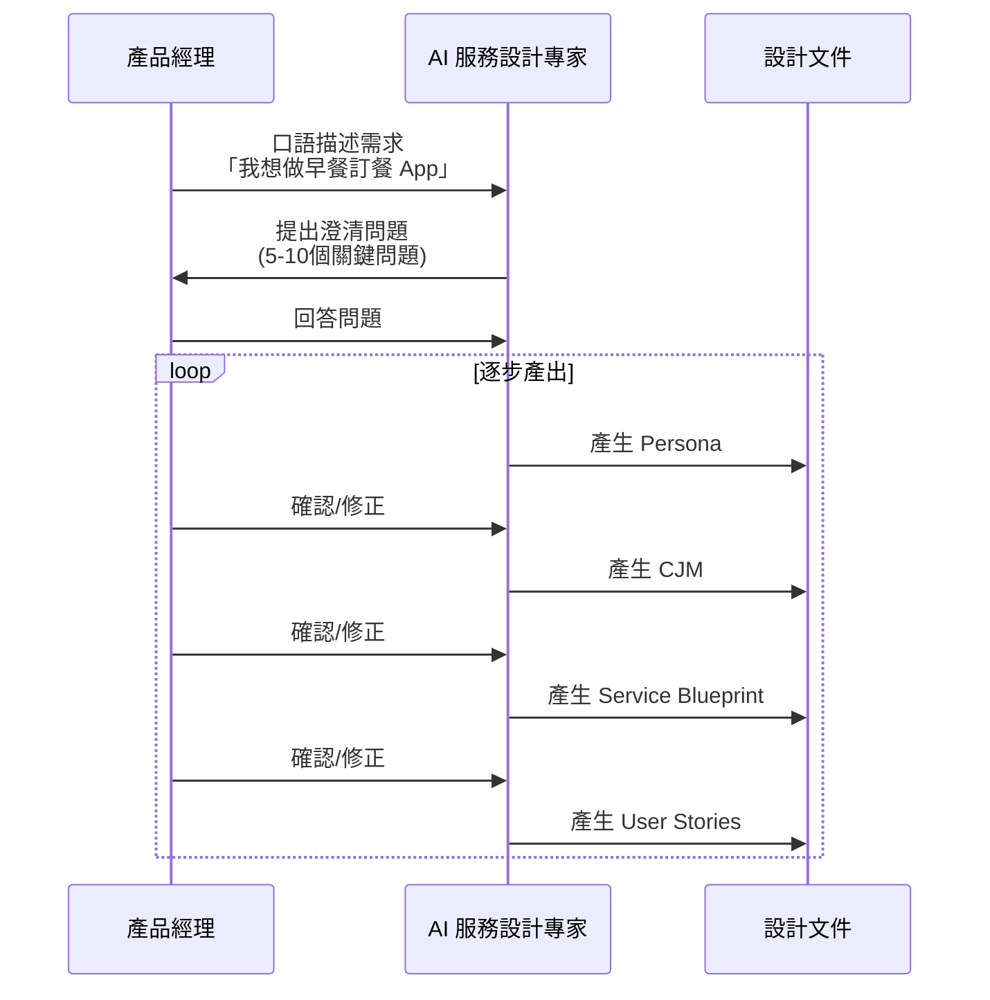

# 服務設計 + SDD 技術架構指南

> 本文檔記錄早餐店訂餐系統的完整方法論：從服務設計探索到規範驅動開發的實踐指南

---

## 目錄

1. [方法論概述](#方法論概述)
2. [Phase 1: 服務設計探索](#phase-1-服務設計探索)
3. [Phase 2: 文件視覺化](#phase-2-文件視覺化)
4. [Phase 3: 規範驅動開發 (SDD)](#phase-3-規範驅動開發-sdd)
5. [Phase 4: 技術實作](#phase-4-技術實作)
6. [API 契約管理](#api-契約管理)
7. [版本控制與變更管理](#版本控制與變更管理)
8. [完整工具鏈](#完整工具鏈)
9. [實踐範例](#實踐範例)

---

## 方法論概述

### 核心理念

```
┌─────────────────────────────────────────────────────────────────┐
│                    雙軌方法論                                     │
├─────────────────────────────────────────────────────────────────┤
│                                                                 │
│   服務設計 (Service Design)          SDD (Spec-Driven Dev)      │
│        ↓                                    ↓                   │
│   「理解用戶需求」                    「定義技術規範」           │
│        ↓                                    ↓                   │
│   Persona → CJM → Blueprint          spec.md → plan.md          │
│        ↓                                    ↓                   │
│   User Stories                        tasks.md → Code           │
│        ↓                                                        │
│   └────────→  整合：packages/api（唯一事實來源） ←────────┘     │
│                                                                 │
└─────────────────────────────────────────────────────────────────┘
```

### 設計原則

1. **AI 協作設計**：透過與 AI（Kimi）對話，逐步澄清需求並產出結構化文件
2. **版本控制一切**：所有設計文件使用 Git 管理，可追蹤、可回溯
3. **類型即規格**：API Schema 同時服務於執行時驗證與編譯時類型檢查
4. **視覺即代碼**：Mermaid 圖表直接嵌入 Markdown，無需額外工具

---

## Phase 1: 服務設計探索

### 1.1 AI 協作流程



### 1.2 設計文件結構

```
docs/design/
└── v1.0.0-YYYYMMDD/              # 版本號-日期
    ├── 00-brief.md              # 需求摘要
    ├── 01-personas.md           # 人物誌（2-4個角色）
    ├── 02-cjm.md               # 客戶旅程地圖
    ├── 03-blueprint.md         # 服務藍圖
    ├── 04-user-stories.md      # 使用者故事
    ├── 05-architecture.md      # 系統架構
    └── assets/                 # 圖片素材（如需要）
```

### 1.3 各文件內容規範

#### 00-brief.md（需求摘要）

包含：
- 產品願景（一句話描述）
- 問題陳述（現況痛點）
- 目標與成功指標（量化）
- 目標用戶（簡要）
- 產品範圍（In/Out Scope）

#### 01-personas.md（人物誌）

每個角色包含：
```yaml
姓名: 陳志明
年齡: 32
職業: 軟體工程師
目標: [節省時間, 餐點準時, 嘗試新口味]
痛點: [選擇困難, 等待不確定, 特殊需求被忽略]
科技接受度: 高
經典語錄: "我就想要快，最好我說『老樣子』它就懂"
```

視覺化：**Mermaid Journey**（一天的生活時間軸）

#### 02-cjm.md（客戶旅程地圖）

六個標準階段：
1. 認知 (Awareness)
2. 考慮 (Consideration)
3. 訂購 (Ordering)
4. 等待 (Waiting)
5. 取餐 (Pickup)
6. 評價 (Review)

每個階段記錄：
- 用戶行動
- 用戶想法
- 情緒曲線（1-5分）
- 接觸點
- 痛點
- 機會

視覺化：**Mermaid Journey**（情緒曲線圖）

#### 03-blueprint.md（服務藍圖）

四層結構：
```
┌─────────────────────────────────────┐
│  用戶行動 (User Actions)             │
├─────────────────────────────────────┤
│  前台接觸點 (Frontstage)             │
├─────────────────────────────────────┤
│  後台流程 (Backstage)                │
├─────────────────────────────────────┤
│  支援系統 (Support Systems)          │
└─────────────────────────────────────┘
```

視覺化：**Mermaid Flowchart TB**（分層流程圖）

#### 04-user-stories.md（使用者故事）

格式：
```markdown
## Epic 1: 功能分類

### US-XXX: 標題
**身為** 角色  
**我想要** 功能  
**如此** 價值

**驗收標準**:
- [ ] 具體可測試的條件1
- [ ] 具體可測試的條件2

**對應設計**:
- CJM: [階段]
- 藍圖: [接觸點]

**API 需求**:
```
GET /api/xxx
Response: { data: Type }
```
```

#### 05-architecture.md（系統架構）

包含：
- 整體架構圖（Mermaid Architecture）
- 技術選型與理由
- 資料模型（Mermaid ER Diagram）
- API 設計
- 前端架構

---

## Phase 2: 文件視覺化

### 2.1 工具選擇：VitePress + Mermaid

**為何不選 Whimsical/Miro？**
- ❌ 需要額外學習
- ❌ 無法版本控制
- ❌ 團隊成員需要帳號

**Mermaid 優勢：**
- ✅ 開發者已熟悉 Markdown
- ✅ Git 版本控制
- ✅ 自動渲染為互動圖表
- ✅ 與程式碼同 repo

### 2.2 VitePress 設定

```typescript
// docs/.vitepress/config.ts
import { defineConfig } from 'vitepress'

export default defineConfig({
  title: '早餐店訂餐系統',
  themeConfig: {
    nav: [
      { text: '服務設計', link: '/design/v1.0.0/00-brief' },
      { text: '技術規格', link: '/specs/' }
    ],
    sidebar: {
      '/design/': [
        {
          text: 'v1.0.0',
          items: [
            { text: '需求摘要', link: '/design/v1.0.0/00-brief' },
            { text: '人物誌', link: '/design/v1.0.0/01-personas' },
            { text: '客戶旅程', link: '/design/v1.0.0/02-cjm' },
            { text: '服務藍圖', link: '/design/v1.0.0/03-blueprint' },
            { text: '使用者故事', link: '/design/v1.0.0/04-user-stories' },
            { text: '系統架構', link: '/design/v1.0.0/05-architecture' }
          ]
        }
      ]
    }
  },
  markdown: {
    config: (md) => {
      md.use(require('vitepress-plugin-mermaid'))
    }
  }
})
```

### 2.3 部署到 GitHub Pages

```yaml
# .github/workflows/docs.yml
name: Deploy Docs
on:
  push:
    branches: [main]
    paths: ['docs/**']

jobs:
  deploy:
    runs-on: ubuntu-latest
    steps:
      - uses: actions/checkout@v4
      - uses: oven-sh/setup-bun@v1
      - run: cd docs && bun install && bun run build
      - uses: peaceiris/actions-gh-pages@v3
        with:
          github_token: ${{ secrets.GITHUB_TOKEN }}
          publish_dir: docs/.vitepress/dist
```

---

## Phase 3: 規範驅動開發 (SDD)

### 3.1 SDD 流程

```
Constitution → Specify → Plan → Tasks → Implement
    ↓            ↓       ↓      ↓         ↓
 項目章程     功能規格  技術方案  任務    程式碼
```

### 3.2 文件結構

```
specs/
└── 001-ai-order/              # 功能編號-名稱
    ├── from-design.md         # 連結到設計文件
    ├── spec.md               # /specify 產生
    ├── plan.md               # /plan 產生
    └── tasks.md              # /tasks 產生
```

### 3.3 各文件內容

#### from-design.md

記錄設計來源與變更：
```markdown
# 設計來源

- **Persona**: [小陳](../../design/v1.0.0/01-personas.md#小陳)
- **CJM**: [考慮階段](../../design/v1.0.0/02-cjm.md#stage-2-考慮)
- **User Story**: [US-004](../../design/v1.0.0/04-user-stories.md#us-004)

## 變更追蹤
- v1.0.0: 初始設計
- 影響範圍：前端 AI 介面、後端 AI 解析 API
```

#### spec.md（功能規格）

由 `/specify` 命令產生：
```markdown
# 功能規格：AI 自然語言訂餐

## 背景
...

## API 介面
- `POST /api/ai-order/parse`
  - Request: `AiOrderParseRequestSchema`
  - Response: `AiOrderParseResponseSchema`

## 驗收標準
- [ ] ...
```

#### plan.md（技術方案）

由 `/plan` 命令產生，包含：
- 資料庫設計
- API 實作細節
- 前端組件設計
- 類型同步檢查清單

#### tasks.md（執行任務）

由 `/tasks` 命令產生，包含：
- Phase 1: 基礎建設
- Phase 2: 後端實作
- Phase 3: 前端實作
- Phase 4: 測試與優化

---

## Phase 4: 技術實作

### 4.1 技術棧

```
┌─────────────────────────────────────────┐
│              前端 (Frontend)             │
│  React + Vite + TanStack (Query/Router) │
└─────────────────────────────────────────┘
                    │ Eden Treaty
                    ↓
┌─────────────────────────────────────────┐
│              後端 (Backend)              │
│  Elysia + Bun + Drizzle ORM             │
└─────────────────────────────────────────┘
                    │
        ┌───────────┼───────────┐
        ↓           ↓           ↓
   ┌─────────┐  ┌─────────┐  ┌─────────┐
   │PostgreSQL│  │  Redis  │  │Kimi API │
   │ (Neon)  │  │(Upstash)│  │         │
   └─────────┘  └─────────┘  └─────────┘
```

### 4.2 關鍵技術選型理由

| 技術 | 理由 |
|------|------|
| **Bun** | 執行快速、內建 TypeScript、適合 Elysia |
| **Elysia** | 端對端類型安全、與 Eden Treaty 整合 |
| **Eden Treaty** | 類型自動同步、無需產生程式碼 |
| **TanStack Query** | 資料快取、背景更新、樂觀更新 |
| **Drizzle** | SQL-like、類型安全、與 TypeBox 搭配 |
| **Kimi** | 中文理解佳、成本低、相容 OpenAI SDK |

---

## API 契約管理

### 5.1 核心原則

```
packages/api/src/schemas.ts 是「唯一事實來源」
         ↓
   ┌─────┴─────┐
   ↓           ↓
Elysia      Eden Treaty
(後端驗證)   (前端類型)
```

### 5.2 Schema 定義範例

```typescript
// packages/api/src/schemas.ts
import { t } from 'elysia'

export const MenuItemSchema = t.Object({
  id: t.Number({ description: '唯一識別碼' }),
  name: t.String({ minLength: 1, description: '菜品名稱' }),
  price: t.Number({ minimum: 0, description: '價格' }),
  category: t.Union([
    t.Literal('主食'),
    t.Literal('飲料'),
    t.Literal('點心')
  ]),
  isAvailable: t.Boolean({ default: true })
}, {
  description: '菜單項目',
  additionalProperties: false
})

// 自動推導 TypeScript 類型
export type MenuItem = typeof MenuItemSchema.static
```

### 5.3 API 變更規範

**向後兼容（允許）：**
- ✅ 新增可選欄位
- ✅ 新增 API 端點

**Breaking Change（禁止直接修改）：**
- ❌ 刪除欄位
- ❌ 修改欄位類型
- ❌ 修改 API 路徑

**正確做法：**
- 建立 v2 Schema
- 或標記舊欄位為 deprecated

---

## 版本控制與變更管理

### 6.1 版本號規範

設計文件版本：`v主版本.次版本.修訂-YYYYMMDD`

| 版本變更 | 說明 | 範例 |
|---------|------|------|
| 主版本 | 重大架構變更 | v2.0.0-20240515 |
| 次版本 | 新增功能 | v1.1.0-20240401 |
| 修訂 | 修正錯誤 | v1.0.1-20240320 |

### 6.2 Git 工作流程

```bash
# 設計文件變更
git add docs/design/v1.1.0/
git commit -m "design(v1.1.0): 新增 AI 點餐設計

- 更新 Persona: 小陳新增語音使用習慣
- CJM: 新增 AI 對話旅程
- 藍圖: 新增 Kimi API 節點
- US: 新增 US-004 ~ US-006

影響規格: specs/001-ai-order/"

# 技術規格變更
git add specs/001-ai-order/
git commit -m "spec(001-ai-order): AI 點餐技術規格

- 對應設計: v1.1.0
- 新增 API: POST /api/ai-order/parse
- 新增 Schema: AiOrderParseRequest/Response"

# 程式碼變更
git add apps/
git commit -m "feat(ai-order): 實作 AI 語音點餐

- 實作 /api/ai-order/parse 端點
- 整合 Kimi API
- 前端 AI 對話介面
- 對應 spec: 001-ai-order

Closes #123"
```

### 6.3 CHANGELOG 格式

```markdown
# 變更日誌

## [v1.1.0] - 2024-04-01
### 新增
- AI 語音點餐功能
  - 自然語言解析 (US-004)
  - 語意搜尋匹配
  - 多輪對話支援
  
### 變更
- Persona「小陳」新增科技接受度：願意使用語音輸入

### 影響範圍
- 前端：新增 AiOrderChat 組件
- 後端：新增 ai-order 路由、Kimi 整合
- 資料庫：新增 ai_sessions 表

### 對應程式碼
- 設計: docs/design/v1.1.0/
- 規格: specs/001-ai-order/
- 分支: feature/001-ai-order
```

---

## 完整工具鏈

| 階段 | 工具 | 用途 | 輸出 |
|------|------|------|------|
| **需求探索** | Kimi / Gemini | AI 服務設計協作 | Markdown 文件 |
| **視覺化** | VitePress + Mermaid | 文件網站 | 靜態網頁 |
| **版本控制** | Git + GitHub | 所有文件版本 | Git history |
| **部署** | GitHub Actions | 自動部署 | GitHub Pages |
| **SDD** | Spec-Kit | 規範驅動開發 | spec/plan/tasks |
| **開發** | Cursor / Claude | 程式碼實作 | TypeScript |
| **API 契約** | TypeBox + Eden | 類型安全 | packages/api |

---

## 實踐範例

### 完整工作流程：新增 AI 點餐功能

#### Step 1: 與 Kimi 進行需求探索

```bash
# 使用 Service Designer 提示詞
kimi chat --prompt prompts/service-designer.md
```

**對話內容摘要：**
```
User: 我想讓用戶可以用語音點餐

Kimi: 為了設計出最貼近用戶的體驗，我需要了解：
1. 目標用戶是誰？（上班族、學生？）
2. 他們現在怎麼點餐？
3. 語音點餐想解決什麼痛點？
...

[經過多輪對話]

Kimi: 根據我們的討論，我建議：
- 主要用戶：小陳（32歲工程師，趕時間）
- 場景：通勤時語音點餐
- 功能：自然語言描述 → AI 解析 → 確認 → 訂單

我來為你產生完整的設計文件...
```

#### Step 2: Kimi 產出設計文件

Kimi 產生以下文件到 `docs/design/v1.1.0/`：

1. **01-personas.md** - 更新小陳的語音使用習慣
2. **02-cjm.md** - 新增 AI 對話旅程分支（含 Mermaid 圖）
3. **03-blueprint.md** - 新增 Kimi API 服務節點（含 Mermaid 圖）
4. **04-user-stories.md** - 新增 US-004 ~ US-006

#### Step 3: 儲存到 Git

```bash
cp -r kim-output/* docs/design/v1.1.0/

git add docs/
git commit -m "design(v1.1.0): 新增 AI 語音點餐設計

- 更新 Persona: 小陳新增語音使用習慣
- CJM: 新增 AI 對話旅程（Mermaid journey 圖）
- 藍圖: 新增 Kimi API 節點（Mermaid flowchart）
- US: 新增 US-004 ~ US-006

影響範圍: specs/001-ai-order/"

git push origin main
```

#### Step 4: 自動部署文件站點

GitHub Actions 自動部署到 `https://yourname.github.io/breakfast-app/`

#### Step 5: 轉換為技術規格

```bash
# 建立規格目錄
mkdir -p specs/001-ai-order

# 建立設計連結檔案
cat > specs/001-ai-order/from-design.md << 'EOF'
# 設計來源

- **Persona**: [小陳](../../design/v1.1.0/01-personas.md)
- **CJM**: [考慮階段](../../design/v1.1.0/02-cjm.md)
- **User Story**: [US-004](../../design/v1.1.0/04-user-stories.md)
EOF

# 使用 Spec-Kit
cd specs/001-ai-order
specify init . --ai claude
```

#### Step 6: SDD 流程

```bash
# /specify - 產生功能規格
# /plan - 產生技術方案
# /tasks - 產生執行任務
# /implement - 實作程式碼
```

#### Step 7: 類型同步檢查

```typescript
// packages/api/src/schemas.ts
export const AiOrderParseRequestSchema = t.Object({
  text: t.String(),
  sessionId: t.Optional(t.String())
})

export const AiOrderParseResponseSchema = t.Object({
  understood: t.Boolean(),
  items: t.Array(ParsedOrderItemSchema),
  needsConfirmation: t.Boolean()
})
```

```bash
# 確保前後端類型同步
bun install  # 更新 workspace 連結

# 檢查 TypeScript
cd apps/backend && bun run typecheck
cd apps/frontend && bun run typecheck
```

#### Step 8: 完成並回饋

```bash
git add .
git commit -m "feat(ai-order): 實作 AI 語音點餐功能

- 實作 POST /api/ai-order/parse
- 整合 Kimi API 自然語言解析
- 實作語意搜尋（pgvector）
- 前端 AI 對話介面（AiOrderChat）
- 多輪對話 Session 管理

對應設計: v1.1.0
對應規格: specs/001-ai-order/
驗收標準:
- [x] 語音輸入解析準確率 > 85%
- [x] 平均回應時間 < 2s
- [x] 前端類型無錯誤

Closes #123"
```

---

## 總結

### 核心價值

1. **AI 協作設計**：透過結構化對話，快速產出高品質設計文件
2. **版本控制一切**：設計、規格、程式碼統一 Git 管理
3. **視覺即代碼**：Mermaid 圖表直接嵌入 Markdown
4. **類型即規格**：API Schema 同時服務前後端
5. **可追溯性**：從需求到程式碼，每步都有連結

### 關鍵文件

| 文件 | 位置 | 用途 |
|------|------|------|
| Service Designer Prompt | `prompts/service-designer.md` | Kimi 協作提示詞 |
| Constitution | `.specify/memory/constitution.md` | API 契約規範 |
| Design Documents | `docs/design/vX.X.X/` | 服務設計產出 |
| Spec Documents | `specs/XXX-{feature}/` | SDD 產出 |
| API Schemas | `packages/api/src/schemas.ts` | 類型唯一事實來源 |

### 推薦閱讀順序

1. 本文件（方法論概述）
2. `PROJECT_GUIDE.md`（實踐指南）
3. `docs/design/v1.0.0/`（設計範例）
4. `specs/001-ai-order/`（SDD 範例）

---

*本文檔版本：v1.0.0*  
*最後更新：2024-03-18*


---

## 附錄 A：Spec-Kit 指令操作詳解

### A.1 核心觀念：上下文感知而非參數驅動

Spec-Kit 的 `/specify`、`/plan` 指令**不是傳統 CLI 的參數模式**，而是在 AI 代理中的**上下文感知指令**：

```mermaid
flowchart LR
    A[Claude Code] -->|執行| B[/specify]
    B -->|自動讀取| C[.specify/memory/constitution.md]
    B -->|讀取上下文| D[用戶提供的設計文件]
    B -->|根據提示| E[生成 spec.md]
```

**關鍵原則**：
> 讓 AI 「看到」設計文件，而不是「指定路徑」給 CLI。

### A.2 /specify 指令（產生 spec.md）

#### 正確操作流程

**Step 1：將設計文件加入上下文**

在 Claude Code 中：
```markdown
# 使用 @ 引用檔案
@docs/design/v1.0.0/04-user-stories.md
@docs/design/v1.0.0/02-cjm.md
```

或手動貼上：
```markdown
請參考以下設計文件：

<file path="docs/design/v1.0.0/04-user-stories.md">
[貼上完整內容]
</file>
```

**Step 2：執行 /specify**

```markdown
/specify

請根據上述 User Stories（特別是 US-004、US-005、US-006）產生功能規格。

要求：
1. 參考 04-user-stories.md 的需求描述
2. 遵循 05-architecture.md 的技術選型
3. 符合 constitution.md 的 API 規範
4. 輸出到 specs/001-ai-order/spec.md

包含：
- 功能背景與目標
- API 介面（TypeBox Schema）
- 驗收標準（對應 User Stories）
- 錯誤處理
- 效能需求
```

#### 常見錯誤

| 錯誤做法 | 問題 | 正確做法 |
|---------|------|---------|
| `/specify "做一個 AI 點餐功能"` | AI 憑空想像，不讀取設計 | 先 `@file` 引用設計文件 |
| `specify --input user-stories.md` | Spec-Kit 不支援 CLI 參數 | 在 AI 對話中提供上下文 |
| 只說「根據設計文件」 | 文件內容不在上下文 | 明確引用或貼上文件內容 |

### A.3 /plan 指令（產生 plan.md）

#### 操作流程

```markdown
# Step 1：引用 spec.md 和 architecture
@specs/001-ai-order/spec.md
@docs/design/v1.0.0/05-architecture.md
@packages/api/src/schemas.ts

# Step 2：執行 /plan
/plan

請根據以下文件產生技術實作方案：

1. specs/001-ai-order/spec.md（功能規格）
2. docs/design/v1.0.0/05-architecture.md（技術架構約束）
3. packages/api/src/schemas.ts（現有 Schema，確保一致性）

產生 plan.md，包含：
- 資料庫設計（DDL）
- 後端實作（Elysia 路由、Service、Repository）
- 前端實作（React 組件、TanStack Query Hooks）
- AI 整合（Kimi API、Prompt 設計）
- 類型同步檢查清單
- 測試策略

輸出到：specs/001-ai-order/plan.md
```

#### 輸入文件對照表

| 指令 | 主要輸入文件 | 輔助輸入文件 | 輸出文件 |
|------|-------------|-------------|---------|
| `/specify` | `04-user-stories.md` | `01-personas.md`, `02-cjm.md` | `spec.md` |
| `/plan` | `spec.md`, `05-architecture.md` | `packages/api/src/schemas.ts` | `plan.md` |
| `/tasks` | `plan.md` | - | `tasks.md` |

### A.4 輔助腳本

建立 `scripts/sdd-init.sh` 簡化流程：

```bash
#!/bin/bash
# scripts/sdd-init.sh

FEATURE_ID=$1
FEATURE_NAME=$2

if [ -z "$FEATURE_ID" ] || [ -z "$FEATURE_NAME" ]; then
    echo "用法: ./sdd-init.sh 001 ai-order"
    exit 1
fi

mkdir -p specs/${FEATURE_ID}-${FEATURE_NAME}

cat > specs/${FEATURE_ID}-${FEATURE_NAME}/from-design.md << 'EOF'
# 設計來源

## 關聯設計文件
- **需求摘要**: [00-brief](../../docs/design/v1.0.0/00-brief.md)
- **人物誌**: [01-personas](../../docs/design/v1.0.0/01-personas.md)
- **客戶旅程**: [02-cjm](../../docs/design/v1.0.0/02-cjm.md)
- **服務藍圖**: [03-blueprint](../../docs/design/v1.0.0/03-blueprint.md)
- **使用者故事**: [04-user-stories](../../docs/design/v1.0.0/04-user-stories.md)
- **系統架構**: [05-architecture](../../docs/design/v1.0.0/05-architecture.md)

## Claude Code 指令參考

### 產生 spec.md
```
/specify

請根據 docs/design/v1.0.0/04-user-stories.md 產生規格。
關注 US-004、US-005、US-006。
輸出到: specs/FEATURE_ID-FEATURE_NAME/spec.md
```

### 產生 plan.md
```
/plan

請根據以下文件產生技術方案：
1. specs/FEATURE_ID-FEATURE_NAME/spec.md
2. docs/design/v1.0.0/05-architecture.md
3. packages/api/src/schemas.ts

輸出到: specs/FEATURE_ID-FEATURE_NAME/plan.md
```
EOF

sed -i "s/FEATURE_ID/${FEATURE_ID}/g" specs/${FEATURE_ID}-${FEATURE_NAME}/from-design.md
sed -i "s/FEATURE_NAME/${FEATURE_NAME}/g" specs/${FEATURE_ID}-${FEATURE_NAME}/from-design.md

echo "已建立 specs/${FEATURE_ID}-${FEATURE_NAME}/"
echo "請參考 from-design.md 中的指令在 Claude Code 中執行"
```

---

## 附錄 B：多平台 SDD 對話腳本

### B.1 平台對照表

| 工具 | 類型 | 啟動方式 | 檔案引用 | 特點 |
|------|------|---------|---------|------|
| **Claude Code** | CLI | `claude` | `@file` | 原生支援 `/specify`，推薦 |
| **Gemini CLI** | CLI | `gemini code` | `@file` 或 `--file` | Google 官方 |
| **Kimi 網頁** | 瀏覽器 | kimi.moonshot.cn | 手動貼上 | 中文理解最佳 |
| **Kimi API** | API | Python 腳本 | 讀取檔案 | 可自動化 |

### B.2 Claude Code（推薦）

```bash
# 安裝
npm install -g @anthropic-ai/claude-code

# 啟動
claude
```

**完整對話流程：**

```markdown
# Step 1: 載入設計文件
@docs/design/v1.0.0/04-user-stories.md
@docs/design/v1.0.0/05-architecture.md

請先總結這些文件的關鍵內容，確認理解：
1. 目標用戶（Persona）
2. 核心需求（User Stories）
3. 技術架構約束
4. 關鍵的用戶旅程時刻

# Step 2: 執行 Specify
/specify

請根據上述 User Stories（特別是 US-004、US-005、US-006）產生功能規格。
要求：
1. 使用 TypeBox Schema 定義 API
2. 驗收標準對應 User Stories
3. 輸出到 specs/001-ai-order/spec.md

# Step 3: 執行 Plan
/plan

請讀取：
1. @specs/001-ai-order/spec.md
2. @docs/design/v1.0.0/05-architecture.md
3. @packages/api/src/schemas.ts

產生技術實作方案，輸出到 specs/001-ai-order/plan.md。

# Step 4: 執行 Tasks
/tasks

請將 plan.md 拆解為可執行的任務，輸出到 specs/001-ai-order/tasks.md。
```

### B.3 Gemini CLI

```bash
# 安裝
gcloud components install gemini

# 啟動
gemini code
```

**對話流程：**

```markdown
# Step 1: 上傳檔案（方式一：啟動時）
gemini code --file docs/design/v1.0.0/04-user-stories.md --file docs/design/v1.0.0/05-architecture.md

# 或方式二：互動模式中
@docs/design/v1.0.0/04-user-stories.md
@docs/design/v1.0.0/05-architecture.md

# Step 2: 產生 Spec（Gemini 不支援 /specify，使用提示詞）
請扮演 Spec-Kit 的 Specify Agent。

根據上述 User Stories 產生功能規格文件。

產生以下內容並儲存到 specs/001-ai-order/spec.md：
---
# 功能規格：AI 自然語言訂餐

## 1. 背景與目標
...

## 2. API 設計
...

## 3. 驗收標準
...
---

# Step 3: 產生 Plan
請扮演 Plan Agent。

根據以下文件產生技術方案：
1. specs/001-ai-order/spec.md
2. docs/design/v1.0.0/05-architecture.md

產生 plan.md，包含：
1. 資料庫設計
2. 後端實作
3. 前端實作
4. AI 整合
5. 測試計畫
```

### B.4 Kimi 網頁版

**訪問：** https://kimi.moonshot.cn

**對話流程：**

```markdown
# Step 1: 準備提示詞（先貼上）
你扮演 Spec-Kit 的 Specify Agent，負責將 User Stories 轉換為技術規格。

我會提供以下文件內容：
1. User Stories（功能需求）
2. Architecture（技術架構約束）
3. Constitution（API 規範）

請確認理解後，我會貼上設計文件。

# Step 2: 貼上設計文件（分批）
## User Stories
[貼上 04-user-stories.md 的 US-004、US-005、US-006]

## Architecture 約束
[貼上 05-architecture.md 的關鍵段落]

## Constitution API 規範
[貼上 .specify/memory/constitution.md 的 API 規範章節]

# Step 3: 產生 Spec
請產生 spec.md 內容，使用 TypeBox Schema 定義 API。

# Step 4: 複製輸出
[複製 Kimi 產生的內容]
[手動建立檔案 specs/001-ai-order/spec.md 並貼上]
```

### B.5 Kimi API（自動化）

```python
#!/usr/bin/env python3
# scripts/kimi-sdd.py

import os
from openai import OpenAI

def read_file(path):
    with open(path, 'r', encoding='utf-8') as f:
        return f.read()

def generate_spec():
    client = OpenAI(
        api_key=os.environ['KIMI_API_KEY'],
        base_url='https://api.moonshot.cn/v1'
    )
    
    # 讀取設計文件
    user_stories = read_file('docs/design/v1.0.0/04-user-stories.md')
    architecture = read_file('docs/design/v1.0.0/05-architecture.md')
    constitution = read_file('.specify/memory/constitution.md')
    
    prompt = f"""
你扮演 Spec-Kit 的 Specify Agent。

請根據以下文件產生功能規格 spec.md：

---
## User Stories
{user_stories}

## Architecture
{architecture}

## Constitution
{constitution}
---

特別關注 US-004、US-005、US-006。
請產生完整的 spec.md 內容，使用 TypeBox Schema 定義 API。
"""
    
    response = client.chat.completions.create(
        model='moonshot-v1-32k',
        messages=[
            {'role': 'system', 'content': '你是 Spec-Kit Specify Agent'},
            {'role': 'user', 'content': prompt}
        ],
        temperature=0.3
    )
    
    os.makedirs('specs/001-ai-order', exist_ok=True)
    with open('specs/001-ai-order/spec.md', 'w', encoding='utf-8') as f:
        f.write(response.choices[0].message.content)
    
    print('spec.md 已產生')

if __name__ == '__main__':
    generate_spec()
```

```bash
# 執行
export KIMI_API_KEY=your-api-key
python scripts/kimi-sdd.py
```

### B.6 平台選擇建議

| 場景 | 推薦工具 | 原因 |
|------|---------|------|
| 日常開發 | Claude Code | 原生支援 `/specify`，流程最順暢 |
| 批次自動化 | Kimi API | 可整合到 CI/CD 流程 |
| 中文需求複雜 | Kimi 網頁 | 中文理解最準確 |
| Google 生態 | Gemini CLI | 與 GCP 整合良好 |

---

## 附錄 C：常見問題 FAQ

### Q1: Spec-Kit 指令報錯「command not found」？

**A**: Spec-Kit 指令（`/specify`、`/plan`）**只在 Claude Code 中有效**。其他工具（Gemini、Kimi）需要使用提示詞模擬相同功能。

### Q2: AI 產生的 spec.md 不符合預期？

**A**: 檢查：
1. 設計文件是否正確載入上下文（使用 `@file` 或貼上內容）
2. 提示詞是否明確指定參考文件
3. 是否說明輸出格式要求

### Q3: 如何確保產生的 Schema 與現有系統一致？

**A**: 在 `/plan` 階段，務必引用：
```markdown
@packages/api/src/schemas.ts
```
並明確要求「與現有 Schema 保持一致」。

### Q4: 設計文件太大，超過 AI 上下文限制？

**A**: 
- 只引用相關章節（如只貼上特定 US 而非整個文件）
- 使用 Kimi API 的 128k 模型
- 分批處理，先產生大綱再細化

### Q5: 如何驗證產生的文件品質？

**A**: 建立檢查清單：
- [ ] spec.md 是否對應 User Stories？
- [ ] plan.md 是否遵循 Architecture？
- [ ] Schema 是否符合 Constitution？
- [ ] 類型是否能正確編譯？

---

*附錄新增日期：2024-03-18*  
*文件版本：v1.1.0*
