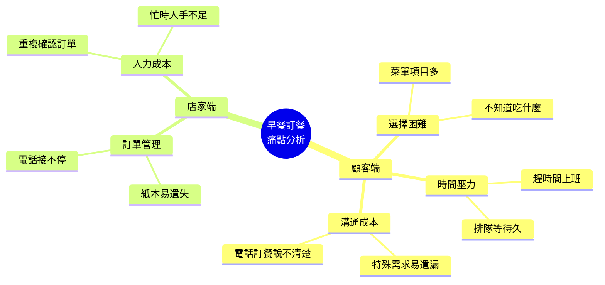
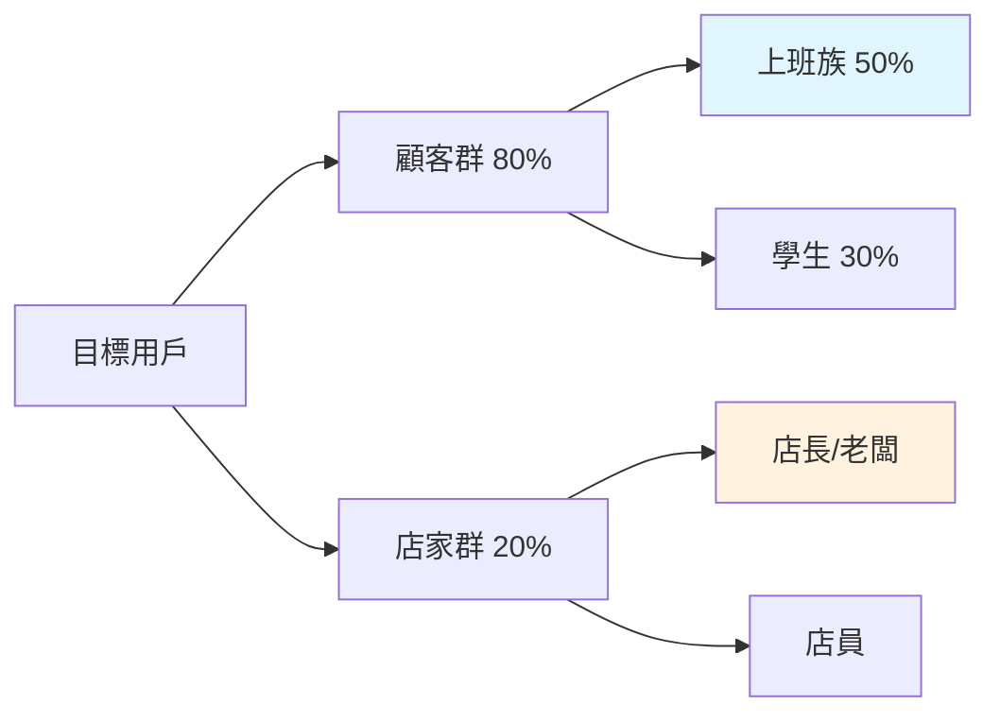
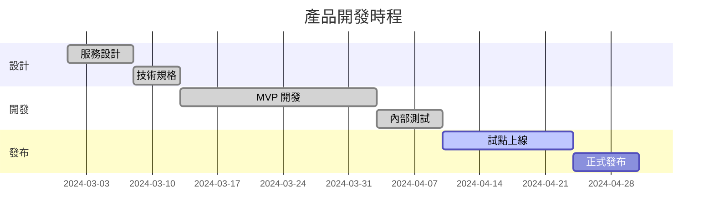

# 需求摘要 (Design Brief)

> 版本：v1.0.0  
> 建立日期：2024-03-18  
> 狀態：已定稿  

---

## 1. 產品願景

### 一句話描述
讓早餐店顧客用「說的」就能快速訂到想吃的早餐，店員也能輕鬆管理訂單。

### 核心價值主張
- **對顧客**：不用滑選單，說「老樣子」或「今天推薦什麼」就能點餐
- **對店員**：自動化訂單管理，減少溝通錯誤
- **對店家**：數據洞察，了解熱門品項與離峰時段

---

## 2. 問題陳述

### 現況痛點

### 使用者回饋（前期訪談）

> 「每次點餐都要滑很久，結果還是點一樣的」- 上班族小陳

> 「電話訂餐常常聽錯，蔥花沒去掉的客訴不少」- 店長阿桑

> 「希望可以先點好，到店直接拿，不用等」- 學生小美

---

## 3. 目標與成功指標

### 3.1 產品目標

| 目標 | 說明 | 衡量方式 |
|------|------|---------|
| **效率** | 縮短點餐時間 | 平均點餐時間 < 30 秒 |
| **準確率** | 減少訂單錯誤 | 訂單錯誤率 < 2% |
| **體驗** | 提升用戶滿意度 | NPS > 50 |
| **採用** | 提高數位訂餐比例 | 線上訂單占比 > 60% |

### 3.2 技術目標

- AI 語音理解準確率 > 85%
- 系統可用性 (Uptime) > 99.5%
- API 回應時間 P95 < 200ms

---

## 4. 目標用戶

### 主要用戶群

### 用戶特徵摘要

| 用戶類型 | 年齡 | 科技接受度 | 主要場景 | 核心需求 |
|---------|------|-----------|---------|---------|
| 上班族 | 25-40 | 高 | 通勤預訂 | 快速、準時 |
| 學生 | 18-25 | 高 | 團購、優惠 | 便宜、社交 |
| 店長 | 35-55 | 中 | 管理報表 | 簡單、穩定 |

詳細人物誌請見 [01-personas](./01-personas)。

---

## 5. 產品範圍

### 5.1 In Scope（範圍內）

**MVP 功能（v1.0.0）**
- [x] 線上菜單瀏覽
- [x] 購物車與訂單建立
- [x] 訂單狀態追蹤
- [x] 店員管理後台

**v1.1.0 規劃**
- [ ] AI 語音點餐
- [ ] 會員與點數系統
- [ ] 推播通知

### 5.2 Out of Scope（範圍外）

- ❌ 外送整合（專注自取）
- ❌ 金流整合（到店付款）
- ❌ 多店管理（單店版本）
- ❌ 庫存管理（未來考慮）

---

## 6. 關鍵假設

### 用戶假設
- 目標用戶有智慧型手機且會使用基本 App
- 用戶願意為了方便提供基本個人資訊
- 用戶接受「先付款後取餐」或「到店付款」

### 技術假設
- 店家有穩定網路
- 用戶手機支援現代瀏覽器
- Kimi API 可用且成本可控

### 商業假設
- 早餐店願意採用數位化工具
- 數位訂單能降低人力成本

---

## 7. 風險與緩解

| 風險 | 可能性 | 影響 | 緩解措施 |
|------|--------|------|---------|
| AI 理解不準確 | 中 | 高 | 提供確認機制，允許人工修正 |
| 店家採用意願低 | 中 | 高 | 強調易用性，提供試用期 |
| 競爭對手模仿 | 高 | 中 | 快速迭代，建立品牌忠誠 |
| 技術成本超支 | 低 | 高 | 監控 API 用量，設定上限 |

---

## 8. 時間規劃

---

## 9. 相關文件

- [人物誌](./01-personas) - 詳細用戶分析
- [客戶旅程地圖](./02-cjm) - 使用情境與痛點
- [技術規格](../../specs/) - 實作細節

---

## 10. 變更記錄

| 日期 | 版本 | 變更內容 | 作者 |
|------|------|---------|------|
| 2024-03-18 | v1.0.0 | 初始版本 | 產品團隊 |
