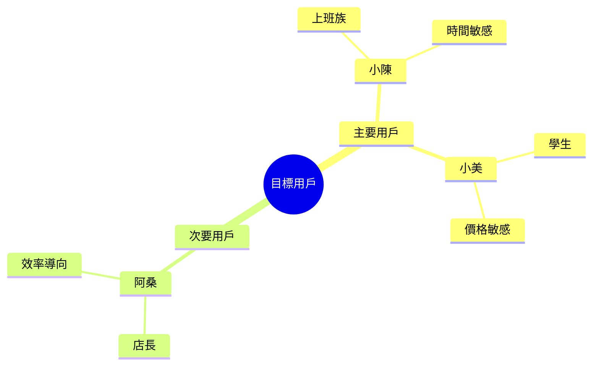
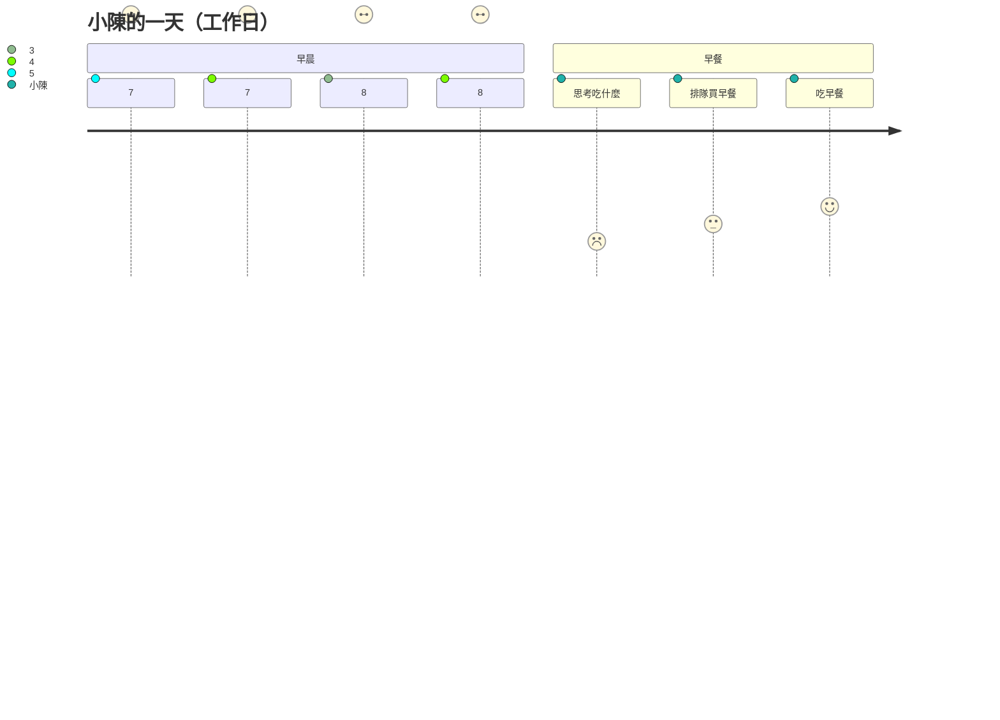
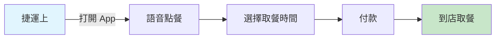
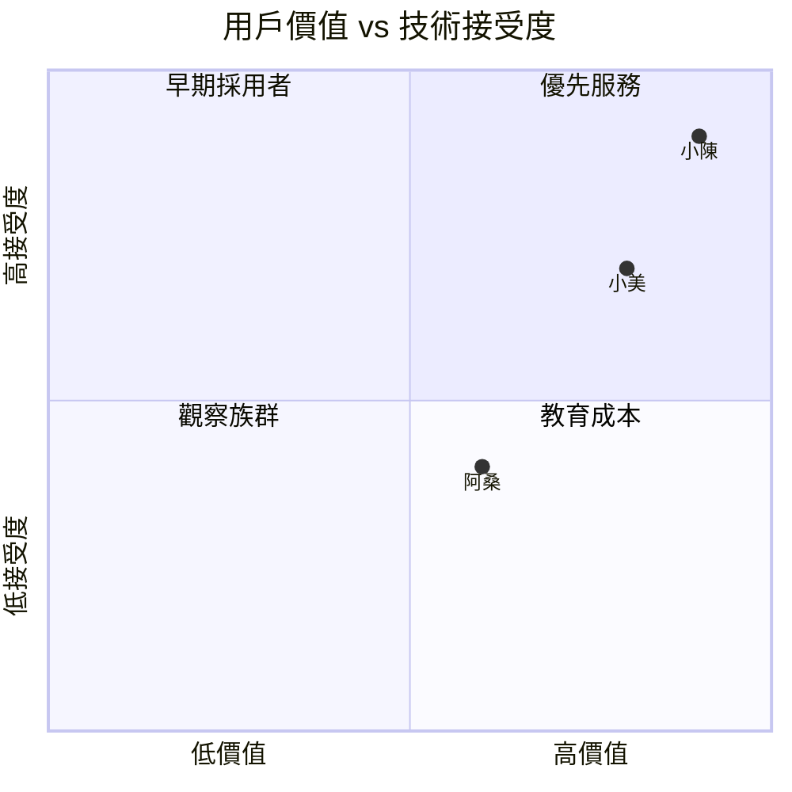

# 人物誌 (Personas)

> 版本：v1.0.0  
> 更新日期：2024-03-18  

---

## 概述

本文件定義早餐店訂餐系統的主要目標用戶。這些人物誌基於前期用戶訪談與市場研究建立。



---

## 主要人物誌 1：小陳（上班族）

### 基本資料

```yaml
姓名: 陳志明
年齡: 32
職業: 軟體工程師
居住地: 台北市中正區
收入: 月薪 6-8 萬
家庭: 已婚，無小孩
通勤: 捷運 30 分鐘
```

### 日常生活



### 目標與動機

| 目標 | 優先級 | 說明 |
|------|--------|------|
| 節省時間 | P0 | 不想浪費時間排隊、等待 |
| 餐點準時準備好 | P0 | 到了就能拿，不用等 |
| 嘗試新口味 | P1 | 想吃點不一樣的，但不知道什麼好吃 |
| 健康飲食 | P2 | 希望能查看營養資訊 |

### 痛點與挫折

> **痛點 1：選擇困難**
> "每次站在店門口都要想半天，後面的人在等壓力很大"

> **痛點 2：等待時間不確定**
> "有時候趕時間，不知道要等多久，乾脆不吃了"

> **痛點 3：特殊需求被忽略**
> "說了不要蔥，結果還是有，只能挑掉"

### 科技使用習慣

- **手機**: iPhone 15，重度使用者
- **常用 App**: Uber Eats、街口支付、Google Maps
- **支付方式**: 主要用手機支付，偶爾現金
- **科技態度**: 早期採用者，願意嘗試新 App

### 經典語錄

> "我就想要快，最好我說『老樣子』它就懂我要什麼"

> "如果可以先點好，我願意多走兩步路到另一家店"

> 「推薦功能很重要，我不知道什麼好吃」

### 使用場景



---

## 主要人物誌 2：小美（學生）

### 基本資料

```yaml
姓名: 林小美
年齡: 20
職業: 大學生（大三）
居住地: 台中市北區（租屋）
收入: 零用錢 + 打工，每月 1-1.5 萬
家庭: 單身，與室友同住
通勤: 腳踏車 15 分鐘
```

### 目標與動機

| 目標 | 優先級 | 說明 |
|------|--------|------|
| 省錢 | P0 | 預算有限，要比價、找優惠 |
| 團購方便 | P0 | 常幫同學代買，要記錄多個訂單 |
| 社交分享 | P1 | 想分享好吃的給朋友 |
| 累積點數 | P1 | 希望有會員優惠 |

### 痛點與挫折

> **痛點 1：團購混亂**
> "幫同學買早餐，常常記錯誰要什麼，錢也算不清楚"

> **痛點 2：預算控制**
> "月底沒錢的時候，想知道今天有什麼特價"

### 科技使用習慣

- **手機**: Android 中階機，會注意流量
- **常用 App**: IG、Dcard、蝦皮
- **支付方式**: 現金為主，有時候用 LINE Pay
- **科技態度**: 實用主義，需要明確好處才會用

### 經典語錄

> "如果可以團購一起點，我可以當班代的角色"

> 「有學生優惠我就用，沒有就繼續用現場點」

---

## 次要人物誌：阿桑（店長）

### 基本資料

```yaml
姓名: 王阿桑
年齡: 45
職業: 早餐店老闆娘
店址: 台北市中正區
經營: 10 年傳統早餐店
員工: 2 名工讀生
營業時間: 5:30 - 11:00
```

### 目標與動機

| 目標 | 優先級 | 說明 |
|------|--------|------|
| 減少錯誤訂單 | P0 | 電話訂單常聽錯，造成浪費 |
| 了解熱門品項 | P0 | 知道什麼賣最好，調整備料 |
| 省時省力 | P1 | 不想花太多時間學複雜系統 |
| 增加營收 | P1 | 吸引更多顧客，提高客單價 |

### 痛點與挫折

> **痛點 1：電話訂餐錯誤**
> "忙起來電話接不停，有時候聽錯，蔥花沒去掉客人很生氣"

> **痛點 2：人力不足**
> "早上最忙的時候，又要做餐點又要接電話"

> **痛點 3：不知從何改善**
> "知道要數位化，但不知道要怎麼開始"

### 科技使用習慣

- **手機**: Android，基本功能（電話、LINE）
- **電腦**: 會用 Excel 記帳，但不熟其他軟體
- **態度**: 需要有人教，害怕複雜操作

### 經典語錄

> "越簡單越好，我不要學一大堆功能"

> "只要讓我省時間、少出錯，我就願意用"

> 「最好有人可以來店裡教我怎麼用」

---

## 人物誌比較



| 人物 | 價值貢獻 | 設計重點 |
|------|---------|---------|
| 小陳 | 高頻高單價 | AI 語音、快速流程 |
| 小美 | 社交擴散 | 團購、分享、優惠 |
| 阿桑 | 系統採用 | 簡單、穩定、好教 |

---

## 設計啟發

### 對小陳的設計
- 語音點餐減少操作步驟
- 預訂功能，時間到就能取
- AI 推薦解決選擇困難

### 對小美的設計
- 團購功能，一次下多個訂單
- 學生優惠專區
- 點數累積兌換

### 對阿桑的設計
- 極簡管理介面
- 大按鈕、大字體
- 語音播報訂單

---

## 下一步

人物誌建立完成後，請參閱：
- [客戶旅程地圖](./02-cjm) - 看看他們怎麼使用系統
- [使用者故事](./04-user-stories) - 具體功能需求
