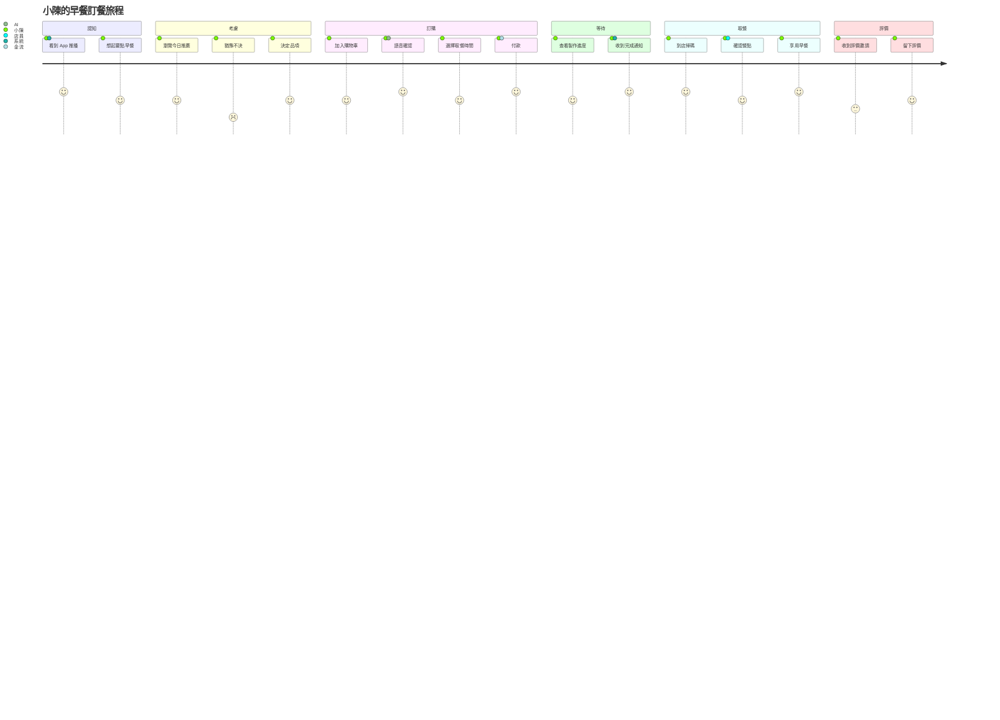
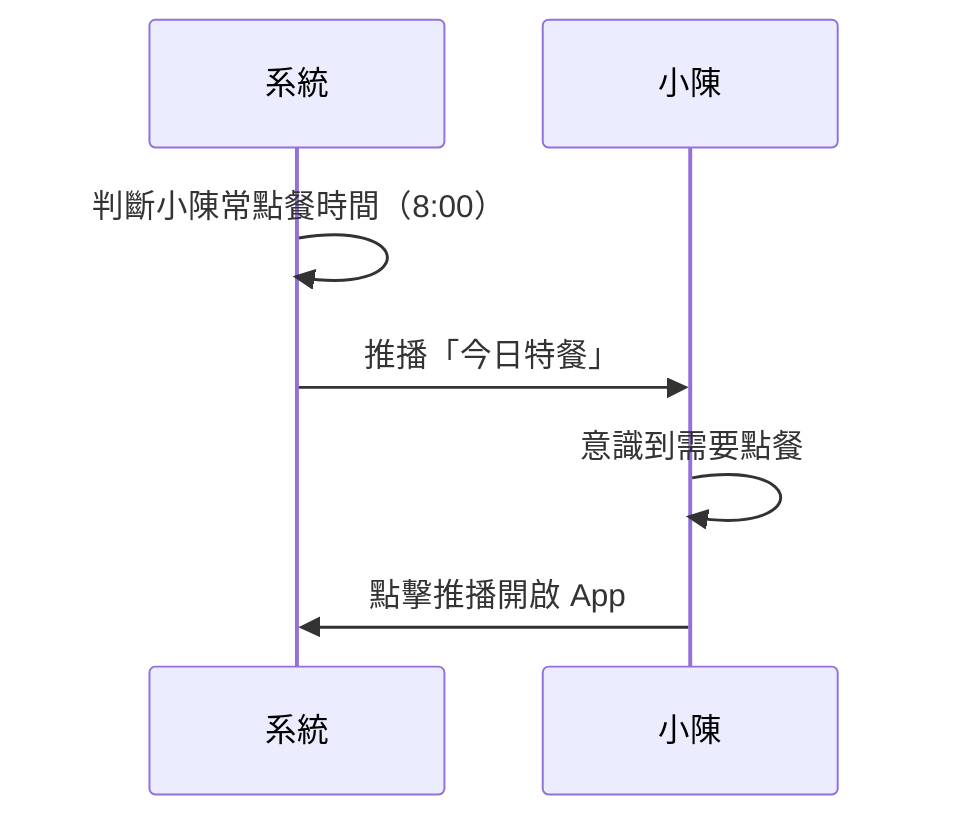
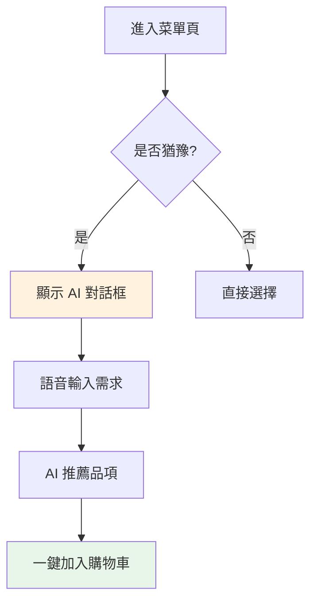
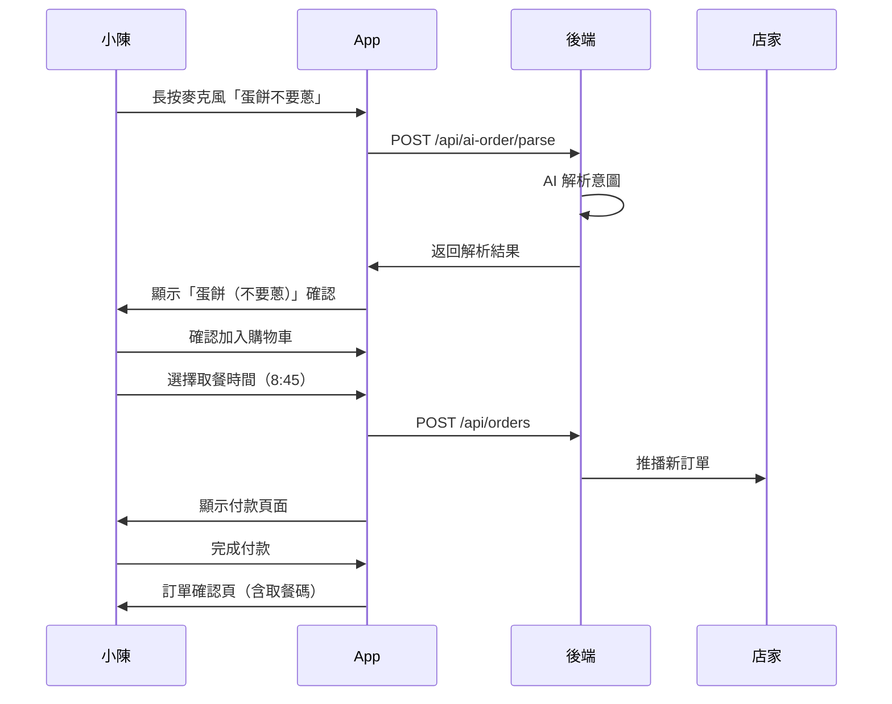
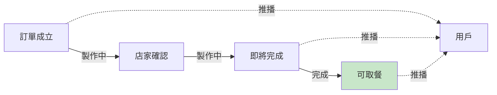
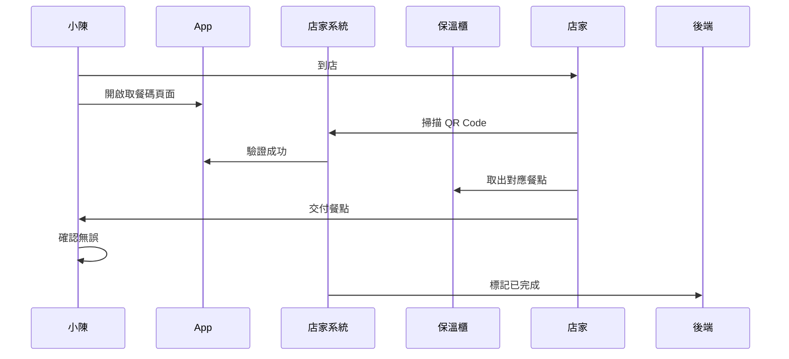
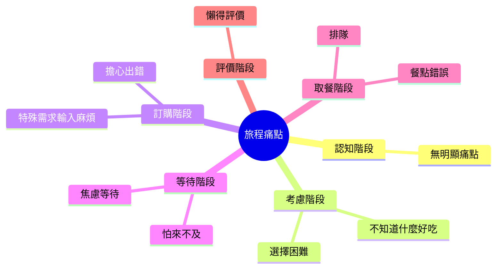

# 客戶旅程地圖 (Customer Journey Map)

> 目標人物誌：小陳（上班族）  
> 場景：工作日的早餐訂餐  

---

## 旅程概覽

---

## 詳細旅程階段

### Stage 1: 認知 (Awareness)

| 項目 | 內容 |
|------|------|
| **用戶行動** | 在捷運上滑手機，看到 App 推播「今日特餐：蔥油餅加蛋」 |
| **用戶想法** | 「對耶還沒點早餐，今天吃什麼好呢？」 |
| **接觸點** | 手機推播通知 → App 圖示 |
| **情緒** | 😊 好奇 |
| **痛點** | 沒有痛點，順暢觸發 |
| **機會** | 個人化推播（根據歷史喜好） |
| **設計回應** | 智慧推播：在常用時間推播喜歡的品項 |

---

### Stage 2: 考慮 (Consideration)

| 項目 | 內容 |
|------|------|
| **用戶行動** | 瀏覽菜單，猶豫不決 |
| **用戶想法** | 「蛋餅吃膩了，但不知道什麼好吃...」 |
| **接觸點** | 菜單頁面、AI 推薦對話框 |
| **情緒** | 😐 困惑 → 😊 驚喜 |
| **痛點** | 選擇太多，決策疲勞 |
| **機會** | AI 個人化推薦、快速再點 |
| **設計回應** | 「老樣子」按鈕、AI 對話推薦 |

**關鍵時刻 (Moment of Truth)**
> 當 AI 準確推薦「你可能喜歡：起司蛋餅（根據你上週點了 3 次）」，用戶感到被理解。

---

### Stage 3: 訂購 (Ordering)

| 項目 | 內容 |
|------|------|
| **用戶行動** | 加入品項、客製化、確認、付款 |
| **用戶想法** | 「不要蔥、醬油少一點，希望店家看得到...」 |
| **接觸點** | 購物車、客製化選項、付款頁面 |
| **情緒** | 😊 流暢 → 😰 擔憂（怕出錯）→ 😊 安心 |
| **痛點** | 特殊需求輸入麻煩、擔心店家沒看到 |
| **機會** | 語音輸入客製化、即時確認機制 |
| **設計回應** | 語音輸入、明確顯示客製化標籤 |

---

### Stage 4: 等待 (Waiting)

| 項目 | 內容 |
|------|------|
| **用戶行動** | 繼續通勤、偶爾查看進度 |
| **用戶想法** | 「好了嗎？還要多久？來得及嗎？」 |
| **接觸點** | 訂單狀態頁、推播通知 |
| **情緒** | 😐 焦慮 → 😊 安心 |
| **痛點** | 不知道製作進度、擔心延遲 |
| **機會** | 透明化進度、提前通知 |
| **設計回應** | 即時進度條、預估等待時間 |

---

### Stage 5: 取餐 (Pickup)

| 項目 | 內容 |
|------|------|
| **用戶行動** | 到店、出示取餐碼、確認餐點 |
| **用戶想法** | 「希望是熱的、正確的、不要等」 |
| **接觸點** | 取餐碼頁面、店內 QR Code 掃描器 |
| **情緒** | 😊 期待 → 😊 滿意（順利）/ 😠 失望（出錯） |
| **痛點** | 排隊、餐點錯誤、餐點冷了 |
| **機會** | 無接觸取餐、準時準備 |
| **設計回應** | 取餐碼驗證、保溫櫃整合 |

---

### Stage 6: 評價 (Review)

| 項目 | 內容 |
|------|------|
| **用戶行動** | 用餐、收到評價邀請、決定是否評價 |
| **用戶想法** | 「還不錯，但專門去評價好麻煩...」 |
| **接觸點** | 推播通知、評價頁面 |
| **情緒** | 😐 懶惰 → 😊 願意（如果有獎勵） |
| **痛點** | 評價流程繁瑣、沒有誘因 |
| **機會** | 簡化評價、點數獎勵 |
| **設計回應** | 一鍵評價、點數回饋 |

---

## 痛點總結

| 優先級 | 痛點 | 影響階段 | 解決方案 |
|--------|------|---------|---------|
| P0 | 選擇困難 | 考慮 | AI 推薦、老樣子 |
| P0 | 擔心出錯 | 訂購 | 語音輸入、明確確認 |
| P1 | 焦慮等待 | 等待 | 進度透明化 |
| P1 | 餐點錯誤 | 取餐 | 取餐碼驗證 |
| P2 | 懶得評價 | 評價 | 簡化流程、點數 |

---

## 機會與設計對應

| 機會 | 設計方案 | 對應頁面 |
|------|---------|---------|
| 個人化推播 | 智慧推播系統 | 手機通知 |
| AI 推薦 | 對話式點餐 | 首頁 AI 入口 |
| 語音輸入 | 長按麥克風 | 菜單頁 |
| 進度透明 | 即時狀態追蹤 | 訂單詳情頁 |
| 無接觸取餐 | QR Code 驗證 | 取餐碼頁 |

---

## 下一步

了解用戶旅程後，請參閱：
- [服務藍圖](./03-blueprint) - 看看前後台如何協作
- [使用者故事](./04-user-stories) - 具體功能需求
