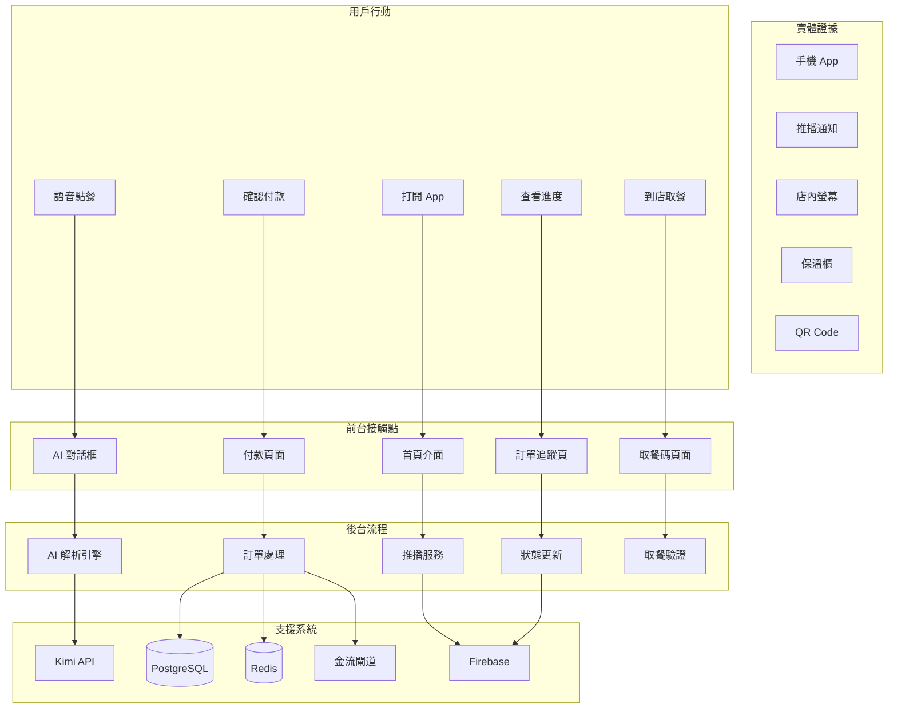
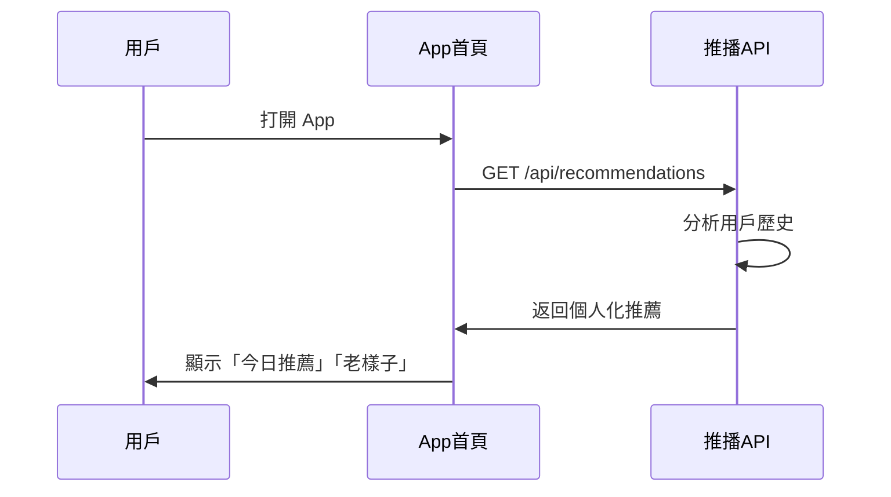
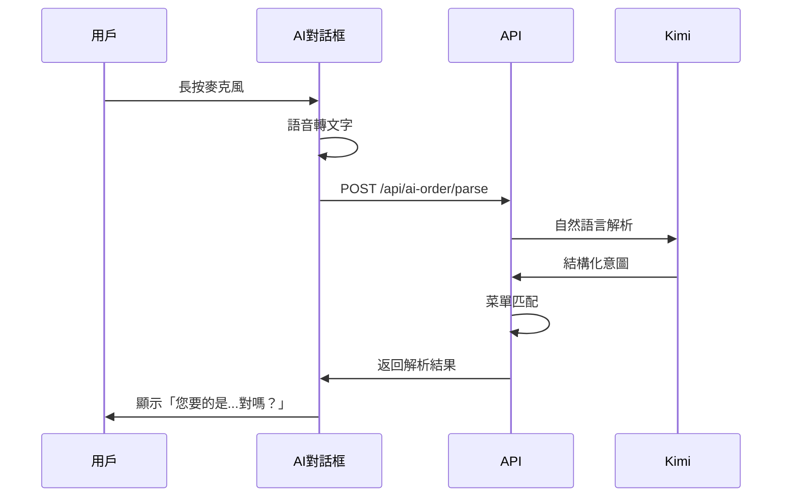
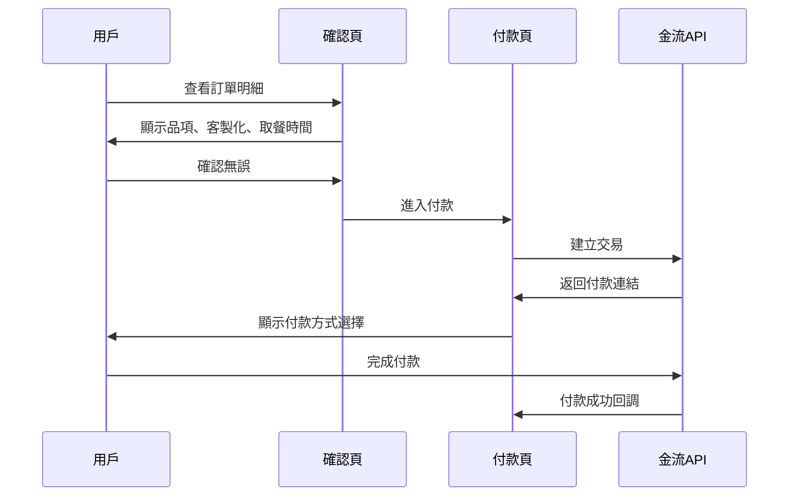
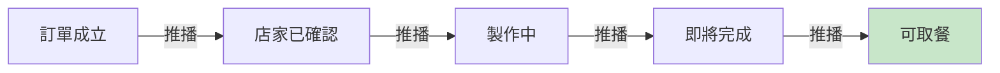
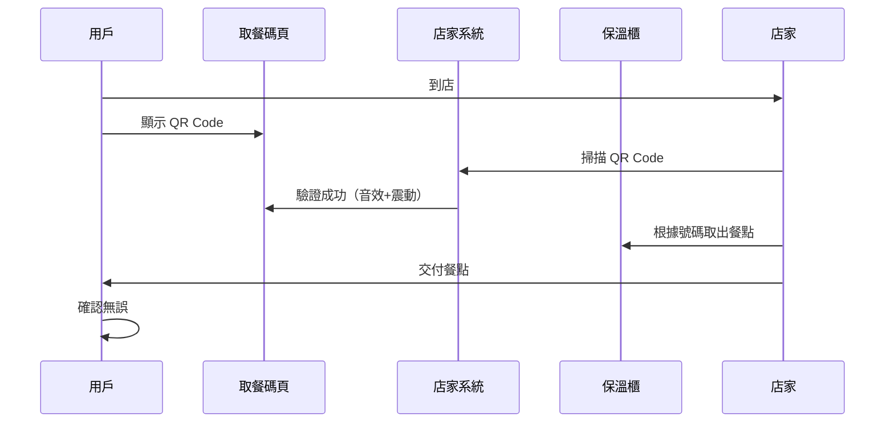
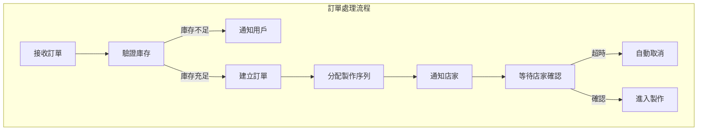

# 服務藍圖 (Service Blueprint)

> 場景：小陳使用 AI 語音點餐並到店取餐  

---

## 藍圖概覽



---

## 分層詳細說明

### 第一層：用戶行動 (User Actions)

| 步驟 | 行動 | 期望 | 情緒 |
|------|------|------|------|
| 1 | 打開 App | 快速開始點餐 | 😊 |
| 2 | 語音描述需求 | 被理解、被推薦 | 😐→😊 |
| 3 | 確認訂單 | 確認無誤、安心 | 😊 |
| 4 | 付款 | 安全、快速 | 😊 |
| 5 | 等待並查看進度 | 透明、準時 | 😐→😊 |
| 6 | 到店取餐 | 快速、正確 | 😊 |

---

### 第二層：前台接觸點 (Frontstage)

#### 接觸點 1：首頁推薦



**介面元素**：
- 智慧推薦卡片
- 「老樣子」快捷按鈕
- AI 對話入口（浮動按鈕）

#### 接觸點 2：AI 對話點餐



**介面元素**：
- 對話式介面（類似 ChatGPT）
- 語音輸入按鈕
- 解析結果卡片（可編輯）
- 一鍵加入購物車

#### 接觸點 3：訂單確認與付款



**介面元素**：
- 訂單明細清單
- 客製化標籤顯示
- 取餐時間選擇器
- 付款方式（信用卡、LINE Pay、現場付）

#### 接觸點 4：訂單追蹤



**介面元素**：
- 進度條（5 階段）
- 預估等待時間
- 取餐碼預覽
- 地圖導航到店

#### 接觸點 5：取餐驗證



**介面元素**：
- 全螢幕 QR Code
- 訂單號碼大字的顯示
- 倒數計時（建議取餐時間）

---

### 第三層：後台流程 (Backstage)

| 流程 | 說明 | 觸發條件 | 輸出 |
|------|------|---------|------|
| 推播服務 | 分析用戶行為，發送個人化推播 | 時間、地點、歷史 | 推播通知 |
| AI 解析引擎 | 自然語言處理、意圖識別 | 用戶語音輸入 | 結構化訂單 |
| 訂單處理 | 驗證、建立、分配訂單 | 用戶確認付款 | 訂單資料 |
| 狀態更新 | 監聽店家操作，更新訂單狀態 | 店家確認、完成製作 | 狀態推播 |
| 取餐驗證 | QR Code 驗證、防重複 | 店家掃描 | 驗證結果 |



---

### 第四層：支援系統 (Support Systems)


#### 系統互動說明

| 系統 | 功能 | 整合方式 | 關鍵指標 |
|------|------|---------|---------|
| **Kimi API** | 自然語言理解 | REST API | 延遲 < 2s, 準確率 > 85% |
| **PostgreSQL** | 持久化儲存 | Drizzle ORM | 可用性 99.9% |
| **Redis** | Session、快取 | ioredis | 延遲 < 10ms |
| **金流閘道** | 付款處理 | Webhook | 成功率 > 99% |
| **Firebase** | 推播通知 | Admin SDK | 到達率 > 95% |

---

## 關鍵時刻 (Service Moments)

### Moment 1：AI 理解正確
```
用戶說：「那個脆脆的、有蛋的」
AI 回：「您要的是『蛋餅』對嗎？」
→ 用戶感到被理解，驚喜
```

### Moment 2：準時準備好
```
用戶 8:30 到店，餐點剛好完成
保溫櫃溫度適中
→ 用戶感到可靠、信任
```

### Moment 3：零錯誤取餐
```
客製化「不要蔥」正確執行
取餐碼一掃即確認
→ 用戶感到安心
```

---

## 失敗點與恢復

| 失敗點 | 原因 | 影響 | 恢復機制 |
|--------|------|------|---------|
| AI 解析失敗 | 語意不清 | 用戶困惑 | 提供手動輸入選項 |
| 付款失敗 | 金流異常 | 訂單中斷 | 保留購物車 15 分鐘 |
| 店家超時未確認 | 忙線 | 用戶等待 | 5 分鐘後自動取消+退款 |
| 餐點錯誤 | 人為疏失 | 客訴 | 一鍵回報+補償機制 |

---

## 實體證據 (Physical Evidence)

| 觸點 | 實體證據 | 設計要求 |
|------|---------|---------|
| App | 手機介面 | 簡潔、快速、直覺 |
| 推播 | 通知訊息 | 個人化、及時 |
| 店內 | 螢幕顯示 | 清晰大字、即時更新 |
| 保溫櫃 | 編號標籤 | 對應訂單、溫度顯示 |
| 取餐 | QR Code | 大尺寸的顯示、易掃描 |

---

## 與 CJM 的對應

| CJM 階段 | 藍圖前台 | 藍圖後台 | 支援系統 |
|---------|---------|---------|---------|
| 認知 | 推播通知 | 推播服務 | Firebase |
| 考慮 | AI 對話框 | AI 解析引擎 | Kimi API |
| 訂購 | 付款頁面 | 訂單處理 | PostgreSQL, 金流 |
| 等待 | 進度追蹤 | 狀態更新 | WebSocket, Firebase |
| 取餐 | 取餐碼頁 | 取餐驗證 | Redis |

---

## 下一步

了解服務流程後：
- [使用者故事](./04-user-stories) - 將藍圖轉為具體需求
- [系統架構](./05-architecture) - 技術實作方案
