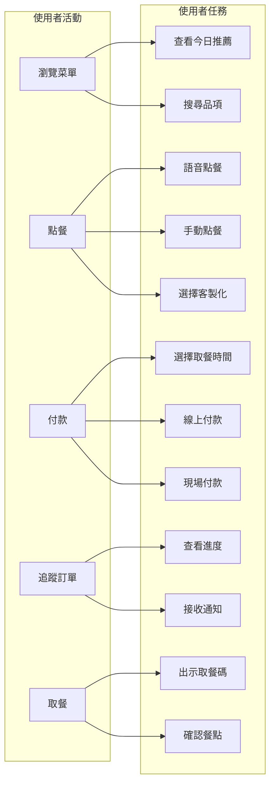
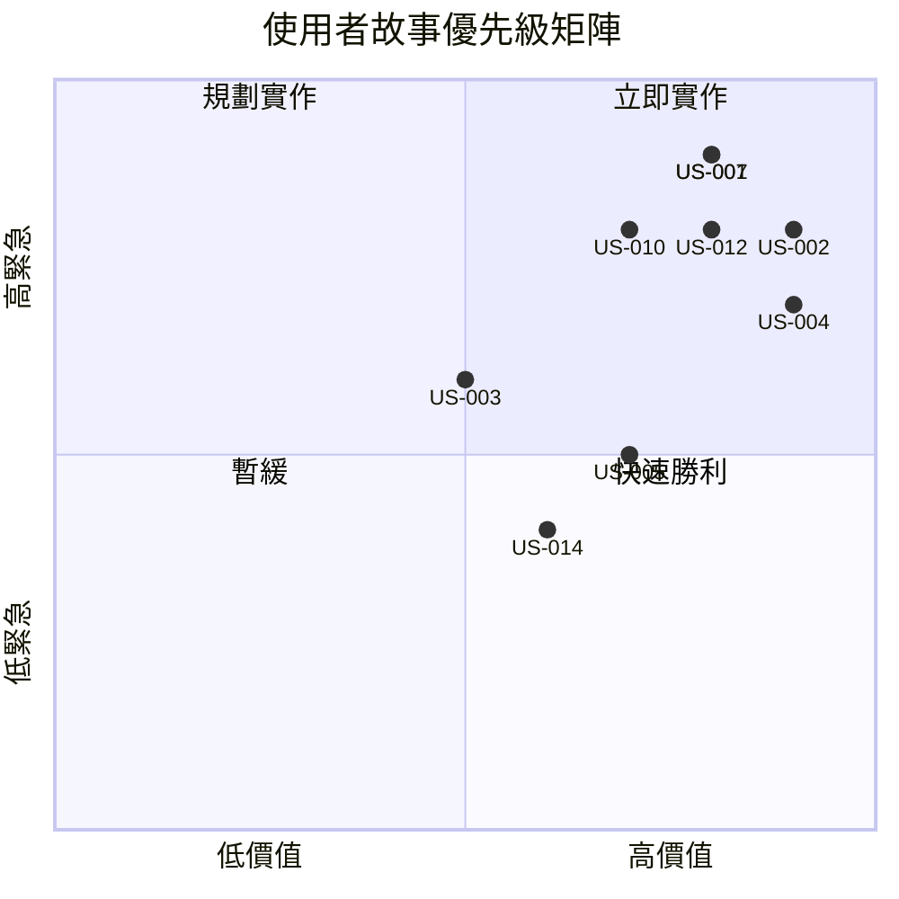

# 使用者故事 (User Stories)

> 本文件將服務設計轉化為可實作的功能需求  
> 格式：身為...，我想要...，如此...  

---

## 故事地圖 (Story Map)



---

## Epic 1: 瀏覽與發現

### US-001: 查看個人化推薦
**身為** 忙碌的上班族  
**我想要** 一打開 App 就看到適合我的推薦  
**如此** 我不用花時間思考要吃什麼

**驗收標準**:
- [ ] 首頁顯示「今日推薦」卡片
- [ ] 根據歷史訂單推薦（最常點的品項）
- [ ] 根據時間推薦（早上推早餐、下午推點心）
- [ ] 顯示推薦原因（「您上週點了 3 次」）

**對應設計**:
- CJM: [考慮階段](./02-cjm.md#stage-2-考慮-consideration)
- 藍圖: [首頁推薦](./03-blueprint.md#接觸點-1首頁推薦)

**API 需求**:
```
GET /api/recommendations?userId={id}
Response: { data: MenuItem[] }
```

---

### US-002: 快速再點「老樣子」
**身為** 習慣吃同樣早餐的用戶  
**我想要** 一鍵點上次的組合  
**如此** 我 3 秒內完成點餐

**驗收標準**:
- [ ] 首頁顯示「老樣子」按鈕
- [ ] 顯示上次訂單的品項與總價
- [ ] 點擊直接進入確認頁
- [ ] 可選擇「老樣子，但這次不要蔥」

**對應設計**:
- Persona: [小陳](./01-personas.md#主要人物誌-1小陳上班族)

---

### US-003: 搜尋菜單
**身為** 想吃特定品項的用戶  
**我想要** 快速搜尋菜單  
**如此** 不用慢慢滑列表

**驗收標準**:
- [ ] 搜尋框支援名稱搜尋
- [ ] 支援分類篩選（主食/飲料/點心）
- [ ] 搜尋結果即時顯示
- [ ] 無結果時顯示「找不到，試試...」

---

## Epic 2: AI 智慧點餐

### US-004: 語音描述點餐（MVP+）
**身為** 不方便打字的用戶  
**我想要** 用說的描述我要什麼  
**如此** 點餐更自然快速

**驗收標準**:
- [ ] 長按麥克風按鈕開始語音輸入
- [ ] 語音轉文字顯示在對話框
- [ ] AI 解析意圖並顯示匹配結果
- [ ] 顯示信心度，低信心度時詢問確認
- [ ] 支援「要那個脆脆的、有蛋的」等模糊描述

**對應設計**:
- CJM: [考慮階段](./02-cjm.md#stage-2-考慮-consideration)
- 藍圖: [AI 對話點餐](./03-blueprint.md#接觸點-2ai-對話點餐)

**API 需求**:
```
POST /api/ai-order/parse
Body: { text: string, sessionId?: string }
Response: { data: AiOrderParseResponse }
```

---

### US-005: AI 推薦今日餐點
**身為** 不知道吃什麼的用戶  
**我想要** 問 AI「今天推薦什麼」  
**如此** 獲得個人化建議

**驗收標準**:
- [ ] 輸入「今天推薦什麼」或「有什麼好吃的」
- [ ] AI 根據歷史與天氣推薦（熱天推冷飲）
- [ ] 顯示推薦理由（「今天很熱，推薦冰豆漿」）
- [ ] 一鍵將推薦加入購物車

---

### US-006: 客製化選項識別
**身為** 有特殊飲食需求的用戶  
**我想要** 說「蛋餅不要蔥」就被理解  
**如此** 不用額外操作選項

**驗收標準**:
- [ ] 識別「不要/加/少/多」等修飾詞
- [ ] 識別常見客製化（蔥、辣、醬油、胡椒）
- [ ] 顯示為標籤在訂單明細
- [ ] 店家後台清楚顯示客製化

---

## Epic 3: 購物車與訂單

### US-007: 管理購物車
**身為** 點多樣品項的用戶  
**我想要** 管理購物車內容  
**如此** 確認無誤後才付款

**驗收標準**:
- [ ] 顯示所有已選品項
- [ ] 可調整數量
- [ ] 可刪除品項
- [ ] 可編輯客製化
- [ ] 即時計算總價

---

### US-008: 選擇取餐時間
**身為** 通勤中的用戶  
**我想要** 設定到店取餐時間  
**如此** 餐點在我到店時剛好準備好

**驗收標準**:
- [ ] 時間選擇器，預設 15 分鐘後
- [ ] 顯示建議時間（根據製作時間）
- [ ] 不可選擇已額滿時段
- [ ] 顯示「趕時間？選這個時段最快」

---

### US-009: 多元付款方式
**身為** 用戶  
**我想要** 選擇喜歡的付款方式  
**如此** 付款順暢

**驗收標準**:
- [ ] 支援信用卡付款
- [ ] 支援 LINE Pay
- [ ] 支援「到店付款」選項
- [ ] 付款失敗時保留購物車 15 分鐘

---

## Epic 4: 訂單追蹤

### US-010: 即時查看訂單狀態
**身為** 等待取餐的用戶  
**我想要** 知道餐點做到哪了  
**如此** 安排到店時間

**驗收標準**:
- [ ] 進度條顯示 5 階段（已接單→確認→製作→即將完成→可取餐）
- [ ] 顯示預估等待時間
- [ ] 即時更新（WebSocket）
- [ ] 顯示訂單詳情（品項、客製化、總價）

**對應設計**:
- CJM: [等待階段](./02-cjm.md#stage-4-等待-waiting)
- 藍圖: [訂單追蹤](./03-blueprint.md#接觸點-4訂單追蹤)

---

### US-011: 接收狀態推播
**身為** 不想一直開 App 的用戶  
**我想要** 在關鍵節點收到通知  
**如此** 知道何時該出發取餐

**驗收標準**:
- [ ] 店家確認時推播
- [ ] 餐點即將完成時推播（5 分鐘前）
- [ ] 餐點已完成時推播
- [ ] 點擊推播直接開啟取餐碼頁面

---

## Epic 5: 取餐體驗

### US-012: 無接觸取餐
**身為** 趕時間的用戶  
**我想要** 快速驗證取餐  
**如此** 不用等待店員查詢

**驗收標準**:
- [ ] 全螢幕 QR Code 顯示
- [ ] 大尺寸的訂單號碼
- [ ] 店家掃描後手機震動+音效確認
- [ ] 顯示「感謝取用」動畫

**對應設計**:
- CJM: [取餐階段](./02-cjm.md#stage-5-取餐-pickup)
- 藍圖: [取餐驗證](./03-blueprint.md#接觸點-5取餐驗證)

---

### US-013: 餐點回報（問題處理）
**身為** 收到錯誤餐點的用戶  
**我想要** 快速回報問題  
**如此** 獲得補償或重新製作

**驗收標準**:
- [ ] 取餐後顯示「確認無誤」按鈕
- [ ] 問題回報表單（品項錯誤、客製化遺漏、溫度問題）
- [ ] 上傳照片佐證
- [ ] 自動退款或補償點數

---

## Epic 6: 會員與忠誠（v1.1.0）

### US-014: 累積點數
**身為** 常客  
**我想要** 每次消費累積點數  
**如此** 下次可折抵

**驗收標準**:
- [ ] 每消費 1 元累積 1 點
- [ ] 點數可折抵現金（100 點 = 1 元）
- [ ] 顯示目前點數餘額
- [ ] 點數到期提醒

---

### US-015: 留下評價
**身為** 用戶  
**我想要** 簡單評價這次的餐點  
**如此** 幫助其他用戶決策

**驗收標準**:
- [ ] 一鍵評價（1-5 星）
- [ ] 選填文字評論
- [ ] 評價後獲得點數獎勵
- [ ] 顯示其他用戶評價

---

## 優先級矩陣



| 優先級 | 故事 | 原因 |
|--------|------|------|
| P0 | US-001, US-007, US-012 | MVP 核心功能 |
| P1 | US-002, US-010, US-011 | 體驗優化 |
| P2 | US-004, US-006 | AI 功能（差異化）|
| P3 | US-014, US-015 | 留存功能（v1.1）|

---

## 與設計文件的對應

| User Story | CJM 階段 | 藍圖接觸點 | 狀態 |
|-----------|---------|-----------|------|
| US-001 | 考慮 | 首頁推薦 | ✅ 已定義 |
| US-004 | 考慮 | AI 對話 | 📝 規格中 |
| US-007 | 訂購 | 購物車 | ✅ 已定義 |
| US-010 | 等待 | 進度追蹤 | ✅ 已定義 |
| US-012 | 取餐 | 取餐驗證 | ✅ 已定義 |

---

## 下一步

使用者故事定義完成後：
- 將 US-004 (AI 點餐) 轉為 [技術規格](../../specs/001-ai-order/)
- 進入 Spec-Kit 流程：/specify → /plan → /tasks
