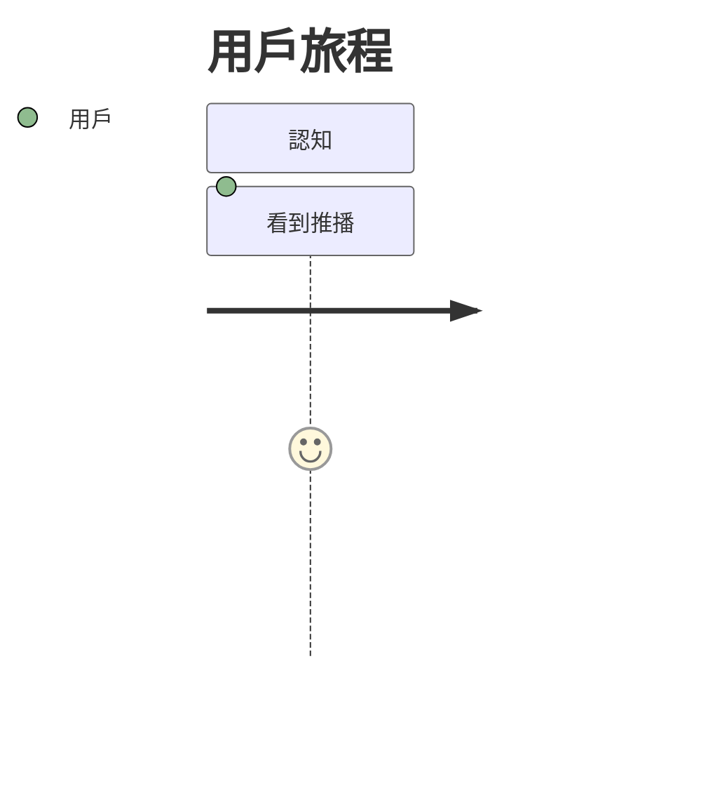

# 早餐店系統 - 專案開發指南

> 本文檔說明如何從需求探索到程式碼實作的完整流程

---

## 工具鏈總覽

```
┌─────────────────────────────────────────────────────────────┐
│                    Phase 1: 需求探索                         │
│              工具：Kimi + Markdown + Mermaid                 │
├─────────────────────────────────────────────────────────────┤
│  使用 prompts/service-designer.md 與 Kimi 協作               │
│       ↓                                                      │
│  產出 docs/design/v1.0.0/                                    │
│    ├── 00-brief.md         # 需求摘要                        │
│    ├── 01-personas.md      # 人物誌（含 Mermaid）            │
│    ├── 02-cjm.md          # 客戶旅程地圖（含 Mermaid）       │
│    ├── 03-blueprint.md    # 服務藍圖（含 Mermaid）           │
│    ├── 04-user-stories.md # 使用者故事                       │
│    └── 05-architecture.md # 系統架構（含 Mermaid）           │
└─────────────────────────────────────────────────────────────┘
                                ↓
┌─────────────────────────────────────────────────────────────┐
│                    Phase 2: 視覺化呈現                       │
│                 工具：VitePress + GitHub Pages               │
├─────────────────────────────────────────────────────────────┤
│  cd docs && bun run build                                    │
│       ↓                                                      │
│  自動部署到 GitHub Pages                                     │
│  https://yourname.github.io/breakfast-app/                   │
└─────────────────────────────────────────────────────────────┘
                                ↓
┌─────────────────────────────────────────────────────────────┐
│                    Phase 3: 技術規格                         │
│                      工具：Spec-Kit                          │
├─────────────────────────────────────────────────────────────┤
│  從 User Stories → specs/001-ai-order/                      │
│    ├── spec.md   # /specify                                  │
│    ├── plan.md   # /plan                                     │
│    └── tasks.md  # /tasks                                    │
└─────────────────────────────────────────────────────────────┘
                                ↓
┌─────────────────────────────────────────────────────────────┐
│                    Phase 4: 實作開發                         │
│            工具：Cursor/Claude + Bun + Elysia                │
├─────────────────────────────────────────────────────────────┤
│  packages/api/          # 共用 Schema（唯一事實來源）         │
│  apps/backend/          # Elysia API                         │
│  apps/frontend/         # React + TanStack                   │
└─────────────────────────────────────────────────────────────┘
```

---

## 快速開始

### 1. 安裝依賴

```bash
# 安裝所有 workspace 依賴
bun install

# 安裝文件站點依賴
cd docs && bun install
```

### 2. 本地開發文件站點

```bash
cd docs
bun run dev
# 訪問 http://localhost:5173
```

### 3. 與 Kimi 進行需求探索

```bash
# 使用 Service Designer 提示詞
# 在 Kimi 網頁或 CLI 中載入 prompts/service-designer.md

kimi chat --prompt prompts/service-designer.md
```

### 4. 部署文件站點

```bash
# 推送到 GitHub 自動部署
git add docs/
git commit -m "design(v1.0.0): 完成服務設計文件"
git push origin main

# GitHub Actions 會自動部署到 GitHub Pages
```

---

## 文件結構說明

### 設計文件 (docs/design/)

| 文件 | 用途 | 產出方式 |
|------|------|---------|
| 00-brief.md | 需求摘要、產品願景 | Kimi 協作 |
| 01-personas.md | 目標用戶分析 | Kimi 協作 |
| 02-cjm.md | 客戶旅程地圖 | Kimi + Mermaid |
| 03-blueprint.md | 服務藍圖 | Kimi + Mermaid |
| 04-user-stories.md | 功能需求 | Kimi 協作 |
| 05-architecture.md | 技術架構 | Kimi + Mermaid |

### 技術規格 (specs/)

| 文件 | 用途 | 產出方式 |
|------|------|---------|
| spec.md | 功能規格 | Spec-Kit /specify |
| plan.md | 技術方案 | Spec-Kit /plan |
| tasks.md | 執行任務 | Spec-Kit /tasks |

### 共用類型 (packages/api/)

| 文件 | 用途 |
|------|------|
| schemas.ts | TypeBox Schema（API 唯一事實來源）|
| types.ts | 輔助 TypeScript 類型 |

---

## 完整工作流程範例

### 情境：新增「AI 語音點餐」功能

#### Step 1: 與 Kimi 探索需求

```bash
kimi chat --prompt prompts/service-designer.md
```

**對話內容**：
```
User: 我想讓用戶可以用語音點餐

Kimi: 太好了！為了設計出最貼近用戶的語音點餐體驗，我需要了解...
[提出 5-10 個澄清問題]

[經過多輪對話後]

Kimi: 根據我們的討論，我建議建立以下設計文件：
1. 更新 01-personas.md（小陳新增語音使用習慣）
2. 更新 02-cjm.md（新增 AI 對話旅程分支）
3. 更新 03-blueprint.md（新增 AI 服務節點）
4. 新增 US-004 ~ US-006 到 04-user-stories.md

請確認後，我會生成完整的 Mermaid 圖表。
```

#### Step 2: 將產出儲存到 Git

```bash
# Kimi 生成的文件複製到 docs/design/v1.1.0/
cp -r ai-output/* docs/design/v1.1.0/

# 更新 CHANGELOG
echo "## [v1.1.0] - $(date +%Y-%m-%d)" >> docs/design/CHANGELOG.md

# 提交
git add docs/
git commit -m "design(v1.1.0): 新增 AI 語音點餐設計

- 更新 Persona：小陳新增語音使用習慣
- CJM：新增 AI 對話旅程
- 藍圖：新增 Kimi API 節點
- User Stories：US-004 ~ US-006

Mermaid 圖表：
- 02-cjm.md: 新增 AI 互動旅程
- 03-blueprint.md: 新增 AI 服務層"
```

#### Step 3: 自動部署文件站點

```bash
git push origin main
# GitHub Actions 自動部署
```

#### Step 4: 轉換為技術規格

```bash
# 在專案根目錄，使用 Spec-Kit
specify init specs/004-ai-voice-order --ai claude

# 進入規格目錄
cd specs/004-ai-voice-order

# 使用 User Story 內容建立 spec.md
# /specify "實作 AI 語音點餐功能，參考 design/v1.1.0/US-004"
```

#### Step 5: 進入 SDD 流程

```bash
# /plan - 產生技術方案
# /tasks - 產生執行任務
# /implement - 實作程式碼
```

---

## 關鍵原則

### 1. Git 是唯一的版本控制

所有文件（設計、規格、程式碼）都在同一個 Git repo，使用：

```bash
# 查看設計變更歷史
git log --oneline -- docs/design/

# 比較版本差異
git diff v1.0.0 v1.1.0 -- docs/design/

# 追蹤特定 User Story 的變更
git log -p --grep="US-004"
```

### 2. Mermaid 即視覺化

不需要額外工具，Markdown + Mermaid = 可版本控制的圖表：

```markdown

```

### 3. 類型即規格

`packages/api/src/schemas.ts` 是 API 的唯一事實來源：

```typescript
// 後端驗證 + 前端類型同步
export const OrderSchema = t.Object({...})
export type Order = typeof OrderSchema.static
```

### 4. AI 協作有脈絡

使用 `prompts/` 目錄儲存標準化提示詞，確保 AI 輸出品質一致。

---

## 常見問題

### Q: 如何更新文件站點？

A: 只要推送到 main 分支，GitHub Actions 會自動部署。

### Q: 如何管理多版本設計？

A: 使用 `docs/design/v1.0.0/`, `v1.1.0/` 目錄，符號連結 `latest` 指向最新版。

### Q: 如何與團隊協作？

A: 
1. 設計文件用 Pull Request 審查
2. 使用 GitHub Discussions 討論設計決策
3. 文件站點作為單一事實來源

### Q: Kimi 輸出品質不穩定怎麼辦？

A:
1. 使用結構化的 prompt（prompts/service-designer.md）
2. 分階段產出（先 Persona → 確認 → 再 CJM）
3. 保存好的輸出作為模板

---

## 參考資源

- [VitePress 文件](https://vitepress.dev/)
- [Mermaid 語法](https://mermaid.js.org/intro/)
- [Elysia 文件](https://elysiajs.com/)
- [Spec-Kit GitHub](https://github.com/github/spec-kit)

---

## 總結

這個工作流的核心理念：

> **所有產出都是程式碼**
> - 設計文件 = Markdown + Mermaid（可版本控制）
> - API 規格 = TypeBox Schema（可執行）
> - 視覺化 = 靜態網頁（自動部署）

不需要學習多個工具，開發者熟悉的 Git + Markdown + 瀏覽器就足夠。
