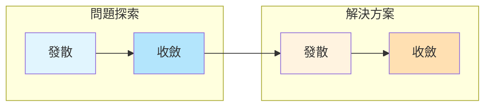

# 服務設計文件

歡迎來到早餐店訂餐系統的服務設計文件。本文件記錄了從使用者研究到功能定義的完整過程。

## 設計方法論

本服務設計採用**雙鑽石模型 (Double Diamond)**：

## 文件架構

### Phase 1: 探索 (Diverge)
- [人物誌 (Personas)](./v1.0.0/01-personas) - 了解目標用戶
- [客戶旅程地圖 (CJM)](./v1.0.0/02-cjm) - 發現痛點與機會

### Phase 2: 定義 (Converge)
- [需求摘要](./v1.0.0/00-brief) - 定義產品方向
- [使用者故事](./v1.0.0/04-user-stories) - 明確功能需求

### Phase 3: 發展 (Develop)
- [服務藍圖](./v1.0.0/03-blueprint) - 設計服務流程
- [系統架構](./v1.0.0/05-architecture) - 技術方案規劃

### Phase 4: 交付 (Deliver)
- [技術規格](../specs/) - 進入 SDD 流程

## 版本歷史

| 版本 | 日期 | 主要變更 | 狀態 |
|------|------|---------|------|
| [v1.0.0](./v1.0.0/00-brief) | 2024-03-18 | 初始版本，基礎訂餐功能 | 已實作 |
| v1.1.0 (規劃中) | - | AI 語音點餐、會員系統 | 設計中 |

## 如何閱讀

建議依序閱讀：
1. 先看 [需求摘要](./v1.0.0/00-brief) 了解背景
2. 閱讀 [人物誌](./v1.0.0/01-personas) 認識用戶
3. 瀏覽 [客戶旅程](./v1.0.0/02-cjm) 理解情境
4. 查看 [服務藍圖](./v1.0.0/03-blueprint) 了解系統
5. 細讀 [使用者故事](./v1.0.0/04-user-stories) 確認需求

---

*文件使用 Git 版本控制，所有變更歷史可於 [GitHub](https://github.com/yourusername/breakfast-app) 查看。*
