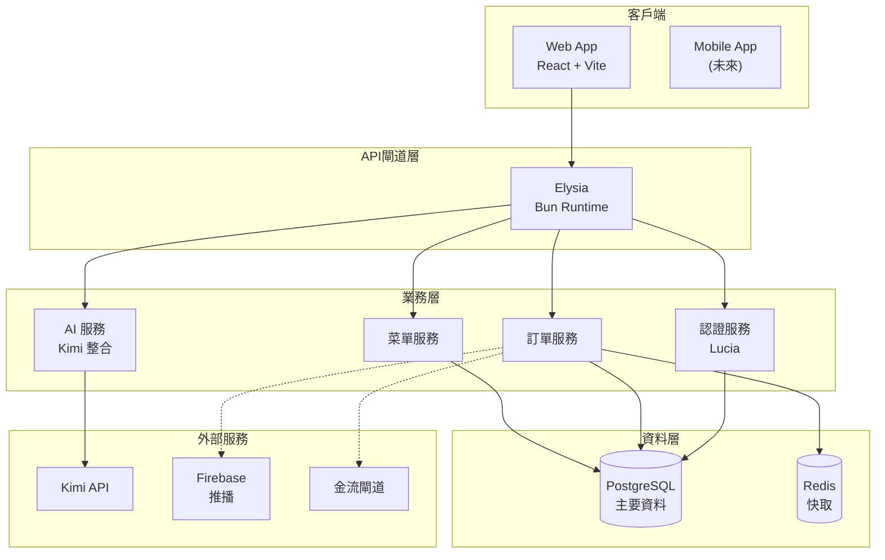
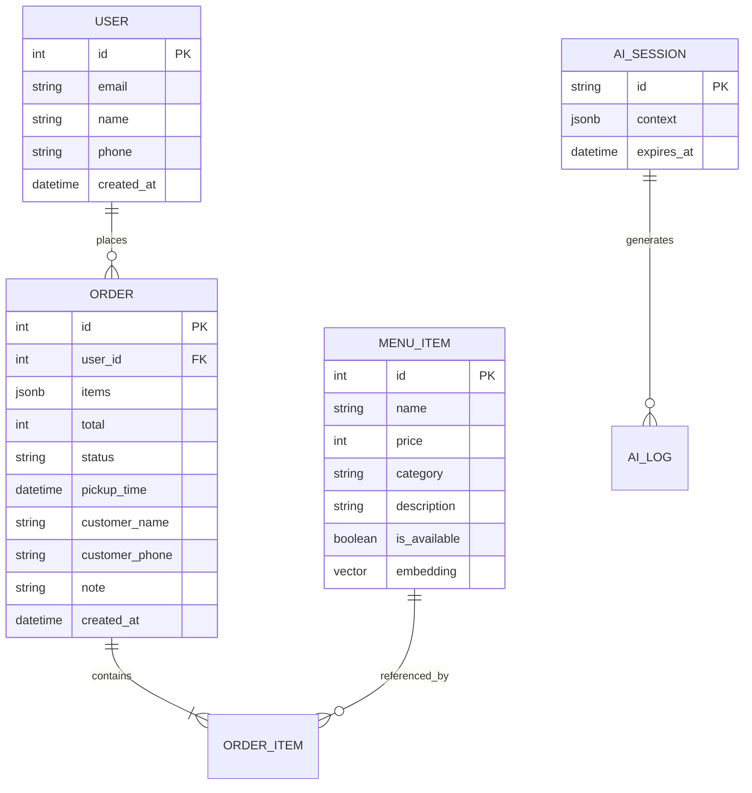
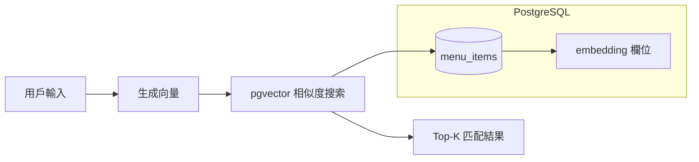
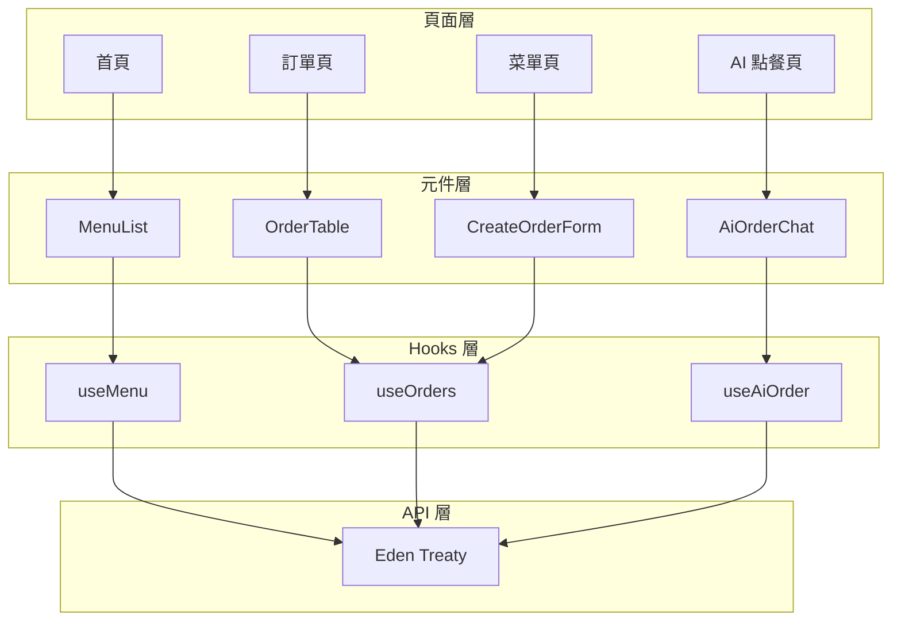
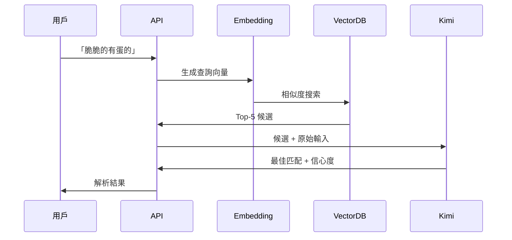
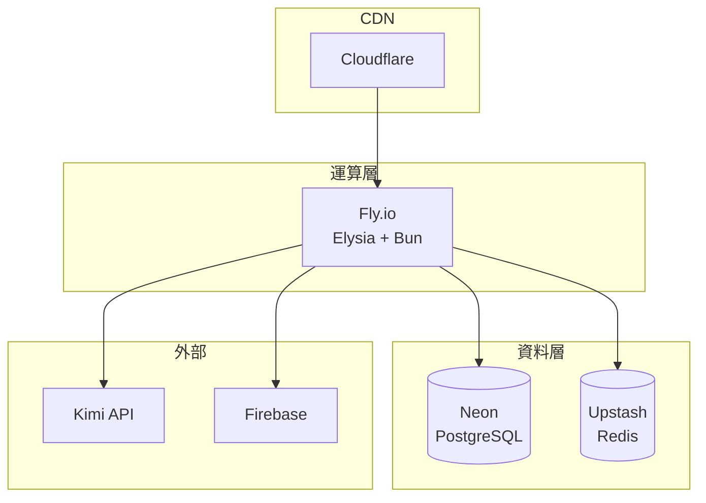
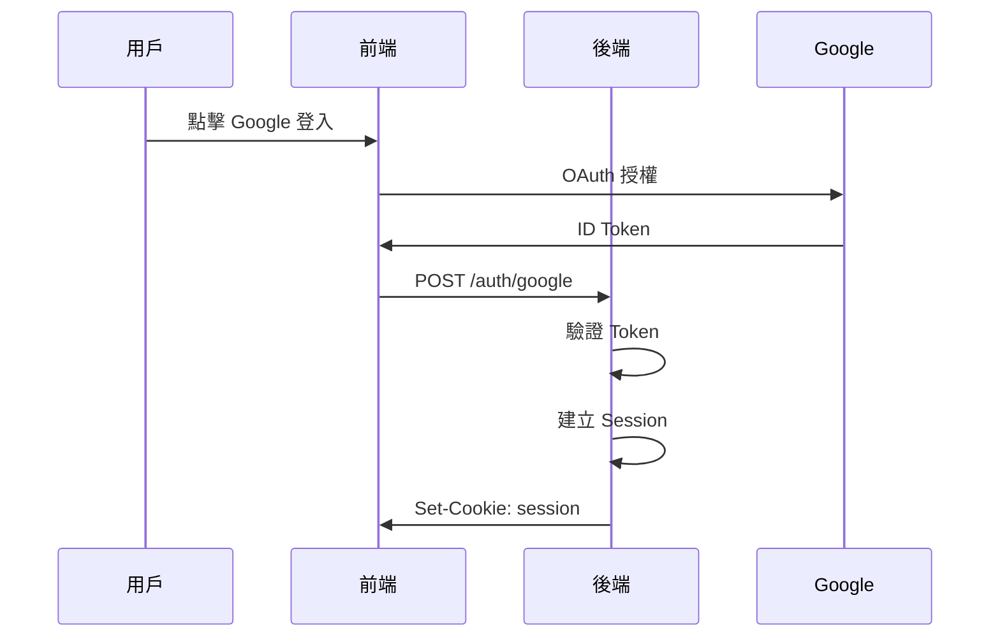

# 系統架構設計

> 技術架構與元件設計

---

## 整體架構



---

## 技術選型理由

| 技術               | 選擇理由                               | 替代方案         |
| ------------------ | -------------------------------------- | ---------------- |
| **Bun**            | 執行快速、內建 TypeScript、適合 Elysia | Node.js          |
| **Elysia**         | 端對端類型安全、效能高、Bun 原生       | Express, Fastify |
| **Eden Treaty**    | 與 Elysia 整合、類型自動同步           | tRPC, GraphQL    |
| **TanStack Query** | 資料快取、背景更新、樂觀更新           | SWR, Apollo      |
| **Drizzle**        | SQL-like、類型安全、與 Elysia 搭配     | Prisma           |
| **Kimi**           | 中文理解佳、成本低                     | GPT-4, Gemini    |

---

## 資料模型

### 核心實體關係



### 向量儲存（AI 搜尋）



---

## API 架構

### RESTful 設計

```
/api
├── /menu
│   ├── GET /           # 取得菜單
│   └── GET /:id        # 取得單一項目
├── /orders
│   ├── GET /           # 取得訂單列表
│   ├── POST /          # 建立訂單
│   ├── GET /:id        # 取得單一訂單
│   ├── PATCH /:id      # 更新訂單狀態
│   └── DELETE /:id     # 取消訂單
├── /ai-order
│   └── POST /parse     # AI 解析自然語言
└── /auth
    ├── POST /google    # Google OAuth
    └── POST /logout    # 登出
```

### WebSocket 事件

```
ws://api/orders/:id/stream

Events:
- order:confirmed    # 店家確認
- order:preparing    # 開始製作
- order:ready        # 即將完成
- order:completed    # 可取餐
```

---

## 前端架構

### 元件層次



### 狀態管理

```typescript
// 全域狀態（TanStack Query）
- menu: MenuItem[]          // 菜單快取
- orders: Order[]           // 訂單列表
- currentOrder: Order       // 當前訂單詳情

// 本地狀態（React State）
- cart: CartItem[]          // 購物車
- aiSession: Session        // AI 對話上下文
```

---

## AI 服務架構

### 語意搜尋流程



### Prompt 設計

```typescript
const SYSTEM_PROMPT = `
你是早餐店點餐助手，專精於理解台灣人的口語描述。

任務：
1. 分析用戶輸入，匹配到最可能的菜單項目
2. 識別數量（預設 1）
3. 識別客製化（不要蔥、加辣等）
4. 回傳 JSON 格式

台灣口語對應：
- "脆脆的" → 蔥油餅
- "軟軟有蛋的" → 蛋餅
- "那個餅" → 需確認是蛋餅還是蔥油餅
- "老樣子" → 上次訂單

回傳格式：
{
  "items": [...],
  "confidence": 0-1,
  "needsConfirmation": boolean
}
`;
```

---

## 部署架構

### 生產環境



### 監控

| 層級 | 工具           | 指標             |
| ---- | -------------- | ---------------- |
| 應用 | Sentry         | 錯誤追蹤         |
| 效能 | Fly Metrics    | 延遲、吞吐量     |
| 業務 | 自建 Dashboard | 訂單量、轉換率   |
| AI   | 自建 Log       | 解析準確率、成本 |

---

## 安全設計

### 認證流程



### 防護措施

- Rate Limiting：每 IP 每分鐘 100 請求
- CORS：僅允許特定域名
- Input Validation：TypeBox Schema 嚴格驗證
- SQL Injection：Drizzle ORM 參數化查詢
- XSS：React 自動跳脫

---

## 擴展規劃

### Phase 1: MVP（v1.0.0）

- 基礎訂餐流程
- 簡易管理後台

### Phase 2: 智慧化（v1.1.0）

- AI 語音點餐
- 會員點數系統
- 推播通知

### Phase 3: 平台化（v2.0.0）

- 多店管理
- 外送整合
- 數據分析儀表板

---

## 技術債管理

| 類型 | 項目           | 嚴重度 | 計劃處理時間 |
| ---- | -------------- | ------ | ------------ |
| 測試 | 缺乏 E2E 測試  | 中     | v1.1.0       |
| 監控 | 基礎日誌 only  | 中     | v1.1.0       |
| 文件 | API 文件自動化 | 低     | v1.2.0       |

---

## 參考文件

- [Constitution](../.specify/memory/constitution.md) - 技術約束
- [packages/api](../../../packages/api/src/schemas.ts) - Schema 定義
- [Backend README](../../../apps/backend/README.md) - 後端詳細文件
